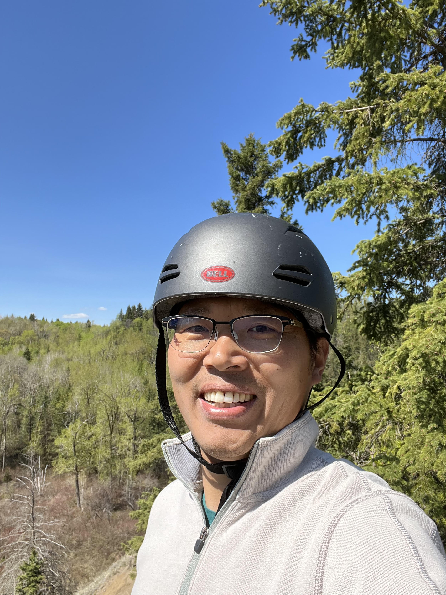
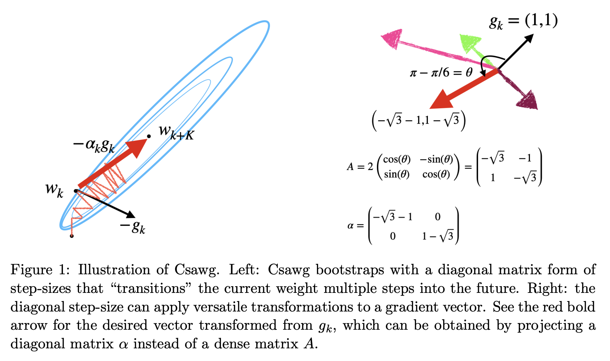
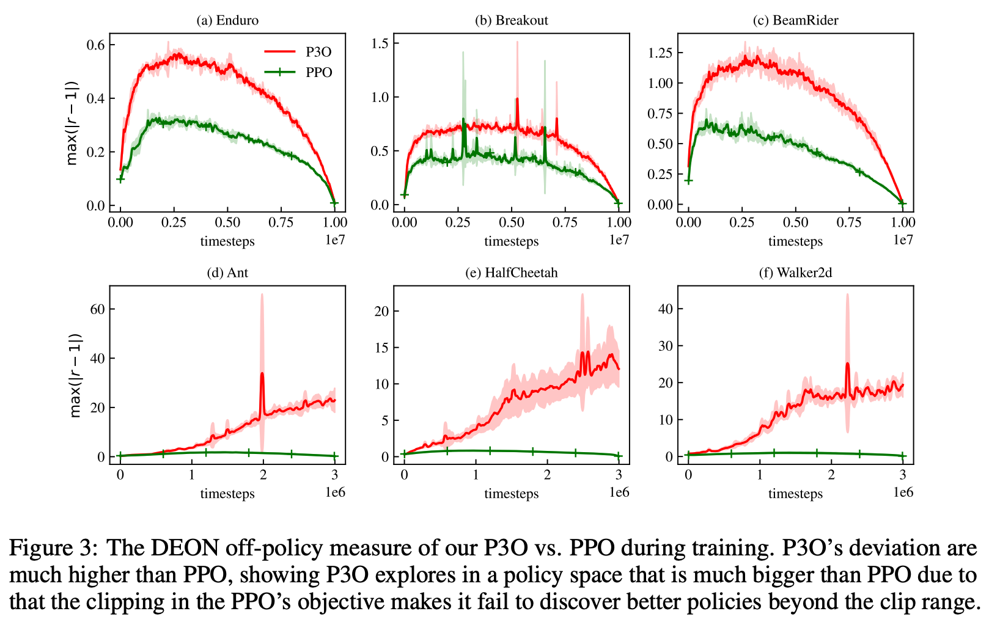
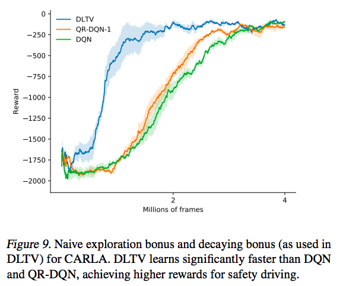
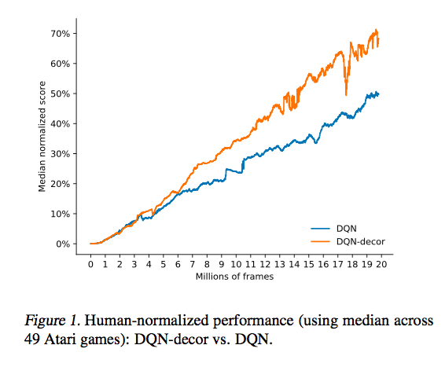

Hi, my name is Hengshuai Yao. My research interest is model-based reinforcement learning with a recent focus on gradient descent especially step-size adaptation. Interesting thing is that I brought a connection between the two seemingly unrelated topics. Check the "learning to accelerate" paper below.

 I'm an adjunct professor at Department of Computing Science, University of Alberta, where I studied reinforcement learning at the RLAI lab from 2008 to 2014. I worked on offline model-based approximate policy iteration, multi-step linear Dyna-style planning, a novel reinforcement learning perspective for PageRank, and Webpage ranking. I did an internship with Yahoo! Sunnyvale in 2013 and won a championship (CEO award) for "TrendingNow" (check yahoo.com at the top right corner) that detects trending topics in Yahoo search engine. I joined NCSoft game studio in San Francisco in 2016 working on reinforcement learning for mobile games. I joined Huawei in 2017 and founded a few joint lab projects with University of Alberta. 

### Publication

- [Learning to Accelerate by the Methods of Step-size Planning](https://arxiv.org/abs/2204.01705). Hengshuai Yao. arXiv:2204.01705. 2022. 

In this paper, I discussed 
<ul>
   <li> a data perspective for gradient descent, and the possibility of using the gradient descent update data to learn and plan step-sizes for an acceleration of gradient descent. </li>
   <li> a new understanding of individual step-sizes for parameters, that the collection of them, in the form of diagonal matrix as we explored in the paper, can be viewed as a multi-step transition model for gradient descent update. </li>
   <li> the diagonal-matrix step-size has the same projection power as a full-sized matrix. Why is this important? The difference is O(n) or O(n^2). The difference is whether O(n) can be exact. This frees the diagonal-step-size from approximating Hessian. </li>
   <li> why negative step-sizes make sense for both deterministic and stochastic settings for fast convergence. </li>
 </ul>

All the above four ideas can be understood from this figure in the paper. 

- [The Sufficiency of Off-policyness: PPO is insufficient according to an Off-policy Measure](https://arxiv.org/pdf/2205.10047.pdf). Xing Chen, Dongcui Diao, Hechang Chen, Hengshuai Yao, Jielong Yang, Haiyin Piao, Zhixiao Sun, Bei Jiang, Yi Chang. arXiv:2205.10047. 2022.

This paper has an interesting observation: The famous PPO algorithm fails to discover better policies that is beyond the clip range of the importance sampling ratio. In particular, the figure below shows better policies can deviate as much as 20 to 60 times from the policy in last iteration! The [1-epsilon, 1+epsilon] clipping for the importance sampling ratio by PPO is way too small. If one increases epsilon for PPO, it can becomes unstable because of the gradient variances. Our P3O is a solution to tame the importance sampling ratio in an interesting way.  

- [Understanding and Mitigating the Limitations of Prioritized Replay](https://openreview.net/pdf?id=HBlNGvIicg9). Yangchen Pan, Jincheng Mei, Amir-massoud Farahmand, Martha White, Hengshuai Yao, Mohsen Rohani and Jun Luo. UAI, 2022. 

- [Exploring Neural Architecture Search Space via Deep Deterministic Sampling](https://ieeexplore.ieee.org/stamp/stamp.jsp?tp=&arnumber=9503404). Keith G. Mills, Mohhamad Salameh, Di Niu, Fred X. Han, Seyed Rezaei, Hengshuai Yao, and Shangling Jui. IEEE Access, pp 110962-110974, volume 9 2021. 

- [Breaking the Deadly Triad with a Target Network](https://arxiv.org/abs/2101.08862). Shangtong Zhang, Hengshuai Yao, and Shimon Whiteson, ICML, 2021.

- [Provably Convergent Two-Timescale Off-Policy Actor-Critic with Function Approximation](https://arxiv.org/abs/1911.04384). Shangtong Zhang, Bo Liu, Hengshuai Yao, and Shimon Whiteson, ICML, 2020.

- [Weakly Guided Few-shot Object Segmentation using Co-Attention with Visual and Semantic Inputs](https://arxiv.org/abs/2001.09540). Mennatullah Siam, Naren Doraiswamy, Boris N. Oreshkin, Hengshuai Yao, and Martin Jagersand, IJCAI, 2020.

- [Mapless Navigation among Dynamics with Social-safety-awareness: a reinforcement learning approach from 2D laser scans](https://arxiv.org/abs/1911.03074). Jun Jin, Nhat M. Nguyen, Nazmus Sakib, Daniel Graves, Hengshuai Yao, Martin Jagersand, ICRA, 2020, Paris, France. 

<iframe width="678" height="381" src="https://www.youtube.com/embed/SJYDiNjwYSQ" frameborder="0" allow="accelerometer; autoplay; encrypted-media; gyroscope; picture-in-picture" allowfullscreen></iframe>

- [Hill-climbing on Value Estimates for Search-control in Dyna](https://webdocs.cs.ualberta.ca/~whitem/publications/pan2019hill.pdf). Yangchen Pan, Hengshuai Yao, Amir Masoud Farahmand, and Martha White. IJCAI. Macau, China, 2019.  

- [Distributional Reinforcement Learning for Efficient Exploration](https://arxiv.org/abs/1905.06125). Borislav Mavrin, Shangtong Zhang, Hengshuai Yao, Linglong Kong, Kaiwen Wu and Yaoliang Yu. ICML, Long Beach, USA. 2019.

One cool thing about deep RL is the theory of distributional RL. However, why do we need to learn a distribution of value functions at all? While the theory of distributional RL is beautiful, it does not answer this question. This paper has an interesting use of the learned value function distribution, in particular, for efficient exploration based on the confidence interval computed from the distribution. Here is the testing performance of this new exploratio method (DLTV) in CARLA. This learns even much faster than QR-DQN, which motivates "Distributional Reinforcement Learning"! 

- [Deep Reinforcement Learning with Decorrelation](https://arxiv.org/abs/1903.07765). Borislav Mavrin, Hengshuai Yao, and Linglong Kong, 2019. 

- [Reinforcing Classical Planning for Adversary Driving Scenarios](papers/iros_final.pdf). Nazmus Sakib, Hengshuai Yao, Hong Zhang. Preprint, March 2019. Video:

<iframe align= "middle" width="750" height="400" src="https://www.youtube.com/embed/9BFYX1WRjtA" frameborder="0" allowfullscreen></iframe>

- [Exploration in the face of Parametric and Intrinsic Uncertainties](papers/dltv_aamas19.pdf). Borislav Mavrin, Shangtong Zhang, Hengshuai Yao, Linglong Kong. AAMAS, Montreal, Canada. 2019.

- [ACE: An Actor Ensemble Algorithm for Continuous Control with Tree Search](https://arxiv.org/abs/1811.02696). Shangtong Zhang, Hao Chen, Hengshuai Yao. AAAI, Honolulu, 2019. (acceptance rate 16.2%)

- [QUOTA: The Quantile Option Architecture for Reinforcement Learning](https://arxiv.org/abs/1811.02073). Shangtong Zhang, Borislav Mavrin, Linglong Kong, Bo Liu, Hengshuai Yao. AAAI (Oral presentation), Honolulu, 2019.

- [Negative Log Likelihood Ratio Loss for Deep Neural Network Classification](https://arxiv.org/pdf/1804.10690.pdf). Future Technologies Conference. Hengshuai Yao, Donglai Zhu, Bei Jiang, Peng Yu, San Francisco, USA. 2019.

- [Towards Comprehensive Maneuver Decisions for Lane Change Using Reinforcement Learning](https://openreview.net/forum?id=SJe9yugRcm). Chen Chen, Jun Qian, Hengshuai Yao, Jun Luo, Hongbo Zhang, Wulong Liu. NIPS Workshop on Machine Learning for Intelligent Transportation Systems (MLITS). 2018. 

- [Monte-Carlo Tree Search vs. Model-Predictive Controller: A Track-Following Example](https://openreview.net/forum?id=SyiF5-23Z&noteId=S1y46fu1M).  NIPS Workshop on Machine Learning for Intelligent Transportation Systems (MLITS), Hengshuai Yao, Masoud S. Nasrati, Kasra Rezaee. Long Beach, USA. 2017. Video:

<iframe align="center" width="630" height="474" src="https://www.youtube.com/embed/YP7qPJSJAVU" frameborder="0" allowfullscreen></iframe>

- [Practical Issues of Action-conditioned Next Image Prediction](https://arxiv.org/abs/1802.02975). Donglai Zhu, Hao Chen, Hengshuai Yao, Masoud Nosrati, Peyman Yadmellat, Yunfei Zhang. IEEE International Conference on Intelligent Transportation Systems (ITSC), 2018.

- [Approximate Policy Iteration with Linear Action Models](papers/lamapi.pdf). Yao, H. and Szepesvari, Cs. Twenty-Sixth Conference on Artificial Intelligence. AAAI. Toronto, Canada. 2012. 

- [Pseudo-MDPs and Factored Linear Action Models](papers/pmdp.pdf). Yao, H., Szepesvari, Cs., Pires, B. A., and Zhang, X. IEEE Symposium on Adaptive Dynamic Programming and Reinforcement Learning (IEEE ADPRL), Best student paper nomination, Orlando, Florida, USA, 2014. 

- [Dyna(k): A multi-step Dyna planning](papers/dynak.pdf). Yao, H., Sutton, R. S., Bhatnagar, S., Diao, D., and Szepesvari, Cs. ICML workshop on Abstraction in Reinforcement Learning, Montreal, Canada. June 2009. 

- [Multi-step linear Dyna-style planning](papers/multi-step-dyna.pdf). Yao, H., Bhatnagar, S., and Diao, D. NIPS, Vancouver, BC, Canada. 2009.

- Linear least-squares Dyna-style planning. Yao, H. Technical Report TR11-04, Department of Computing Science, University of Alberta. 2011.

- [Preconditioned temporal difference learning](papers/ptd.pdf). Yao, H., and Liu, Z-Q. ICML, Helsinki, Finland. June 2008. 

- [Minimal residual approaches for policy evaluation in large sparse Markov chains](papers/mr.pdf). Yao, H., and Liu, Z-Q. The Tenth International Symposium on Artificial Intelligence and Mathematics (ISAIM), Fort Lauderdale, USA. January 2008. 
   
- [LMS-2: towards an algorithm that is as cheap as LMS and almost as efficient as RLS](papers/lms2.pdf). Yao, H., Bhatnagar, S., and Szepesvari, Cs. The Forty-eighth IEEE Control and Decision Conference (CDC), Shanghai, China. December 2009. 

- Temporal difference learning by direct preconditioning. Yao, H., Bhatnagar, S., and Szepesvari, Cs. Multidisciplinary Symposium on Reinforcement Learning (MSRL), Montreal, Canada. June 2009. 

- Off-policy learning with linear action models: an efficient "One-Collection-For-All-Solution". Yao, H. In workshop on "Planning and Acting with Uncertain Models" at the 28th ICML, Bellevue, Washington, USA. 2011. 

- [Universal Option Models](papers/uom.pdf). Yao, H., Szepesvari, Cs., Sutton, R., and Bhatnagar,S. 2014. NIPS. Montreal, Quebec, Canada. 

- [Reinforcement Ranking](papers/rr.pdf). Yao, H. and Schuurmans, D. 2013. 
    
- [A System to Predict Future Popularity: Learning to Classify](papers/trending.pdf). Lee, C., Yao, H., He, X., Su, C., and Chang, J-Y. WWW (poster), Seol,Korea, 2014. 

- [MaxRank: Discovering and Leveraging the Most Valuable Links for Ranking](papers/maxrank.pdf). Yao, H. 2012.
       
-  [A Study of Temporal Citation Count Prediction using Reinforcement Learning](papers/citation.pdf). Yao, H., Sutton R. and Rafiei D. accepted by IEEE Transaction on Cybernetics-part B, 2014. 

### Education: 
* Ph.D, University of Alberta, Computing Science, 2008--2014. 
* M.E, Tsinghua University, department of computer science and engineering, 2003--2006.
* B.S, Shandong University of Technology, department of mathematics, 1999--2003.  
* Zhaoyuan 1st Middle School, 1996--1999. 

### Thesis
- Model-based Reinforcement Learning with State and Action Abstractions. [Ph.D thesis](papers/yao_hengshuai_PhD.pdf), Hengshuai Yao, defended in 2015. Thesis supervisor: [Csaba Szepesvari](https://sites.ualberta.ca/~szepesva/index.html). 

### Reviewing
AAAI, ICML, NIPS, UAI, ADPRL, AIStat, CIKM, WWW.

## Robocup Soccer 
I was a member of TsinghuAeolus (soccer simulation team at Tsinghua University) for World Cup Simulation League. 
Here shows a game of our team TsinghuAeolus playing against Everest in the final match at Robocup 2003. Our TsinghuAeolus was based on hierarchical reinforcement learning. Decisions the player has to make include: dribbling, passing, running, shooting, goal keeping, positioning (team position), resting, defending, etc. A high-level policy learns how to select a decision, and a low-level controller executes the selected decision. Both the high-level and low-level controller were learned using reinforcement learning.  

<video src="videos/2d simulation game short.mp4" width="640" height="400" autoplay controls preload></video>

## Tetris
I developed a policy iteration algorithm to play a Tetris game. In this game, there are only hard shapes: "S" and "Z". The player was trained with data of randomly playing the game. 

  
<video src="videos/SZ tetris game short.mp4" width="640" height="400" autoplay controls preload></video>

### Students 
- Xing Chen, cosupervised with Yi Chang and Hechang Chen, School of Artificial Intelligence, Jilin University. 2020--; Visiting Alberta from August 2022. 
- Yanqing Wu, cosupervised with Randy Goebel, Department of Computing Science, University of Alberta. September 2022--
- [Shangtong Zhang](http://shangtongzhang.github.io/), Department of Computing Science, University of Alberta. mentored 2018 summer, now an assistant professor at University of Virginia. Shangtong taught me what is productivity, creativity and persistence. 
- [Mennatullah Siam](https://scholar.google.com/citations?user=AVPds3kAAAAJ&hl=ar), Department of Computing Science, University of Alberta. mentored 2019. Now a postdoc at York University. Menna taught me what is real passion for research. 
- [Khuram Javed](https://scholar.google.com/citations?user=wG1tGakAAAAJ&hl=en), Department of Computing Science, University of Alberta, mentored in summer 2019, and I was learning "meta" from him.  
- [Chao Gao](https://cgao3.github.io/), Department of Computing Science, University of Alberta, mentored in summer 2019 to 2020 on MCTS. Chao taught me how MCTS works (however it appears I didn't learn well at that time; Only in 2022 I had a chance to better grasp it) and the game of Hex, for which he won the world Hex Tournament Champion twice. 
- [Abhishek Naik](https://abhisheknaik96.github.io/), Department of Computing Science, University of Alberta, mentored in summer 2019. Abhishek taught me why the widely used discounted-reward objective, which is the standard RL setting, does not make so much sense, in particular, for episodes that are very long. 
- [Yangchen Pan](https://scholar.google.ca/citations?user=QyAsyYEAAAAJ&hl=en), Department of Computing Science, University of Alberta, mentored in summer 2019. Yangchen taught me the backward model for model-based RL. 
- Yi Liu. Department of Mathematical and Statistical Sciences, University of Alberta. mentored in summer 2019. We were working on UCB and I was learning the mathematics behind UCB from him. 
- Nazmus Sakib, cosupervised with Hong Zhang, Department of Computing Science, University of Alberta. Nazmus graduated in 2020. Nazmus taught me what is positively making things possible with magic fingers from hard work. 
- Arash Pourzarabi, a very talented student I mentored in 2019 summer, always missed by us in [PS752](https://www.cbc.ca/news/canada/edmonton/alberta-victims-plane-crash-iran-1.5418751). Together we were working on deorrelation features for DQN. One month ago before that, he and me we were having lunch at Phobulous near UofA and I always remember his smile and bright eyes. 

<!-- 
## Openprice
The mobile App is the product of our startup Openprice which I cofounded in 2016. The app helps users manage their receipts and manage shopping.  

Uploading receipts and have it OCR-ed:
<video src="videos/upload receipt.mp4" width="640" height="400" autoplay controls preload></video>

Backend server extract structured data, send it back and display on user's phone:
<video src="videos/Receipt_details.mp4" width="640" height="400" autoplay controls preload></video>

Store search and catalog search (the girl on skype is Reka our App and UI designer)
<video src="videos/store search catalog search.mp4" width="640" height="400" autoplay controls preload></video>

Catalog we built (shown is Json format. The json files was injected to a MySQL database)
<video src="videos/catalogDemo2.mp4" width="640" height="400" autoplay controls preload></video>

-->

## Contact
hengshu1 "At@" ualberta.ca

 

