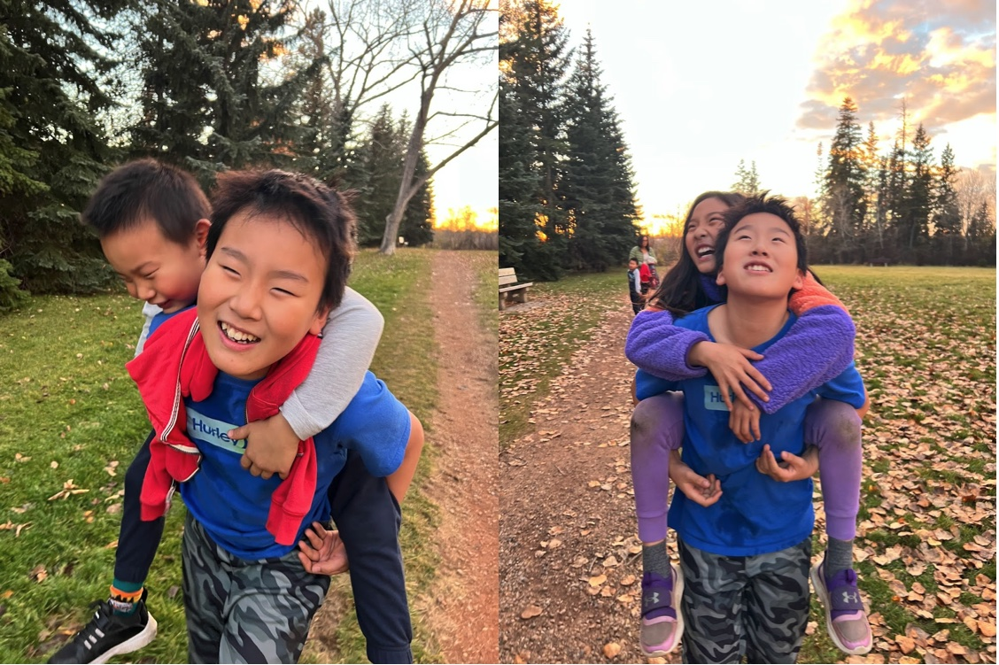
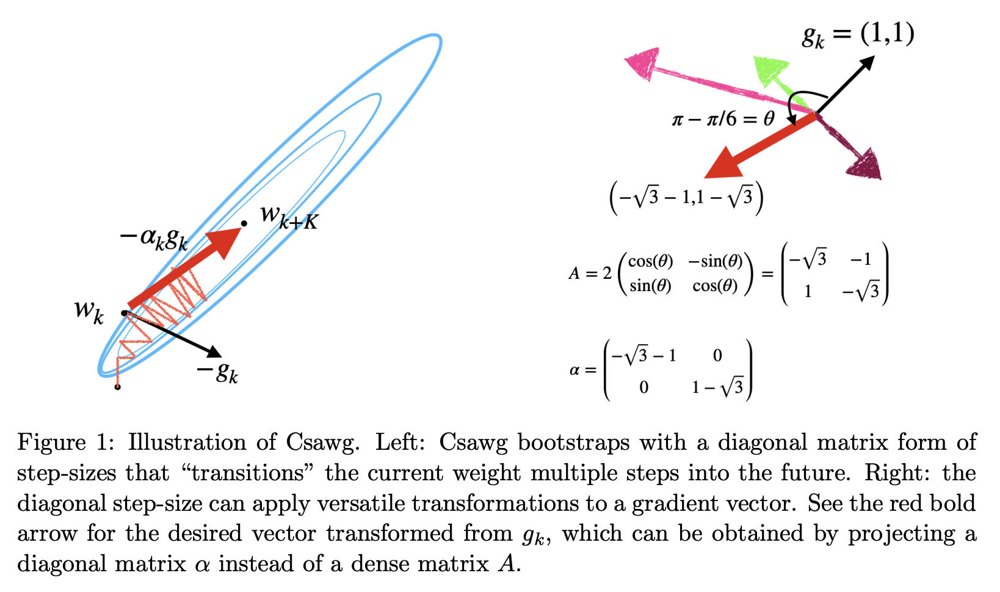
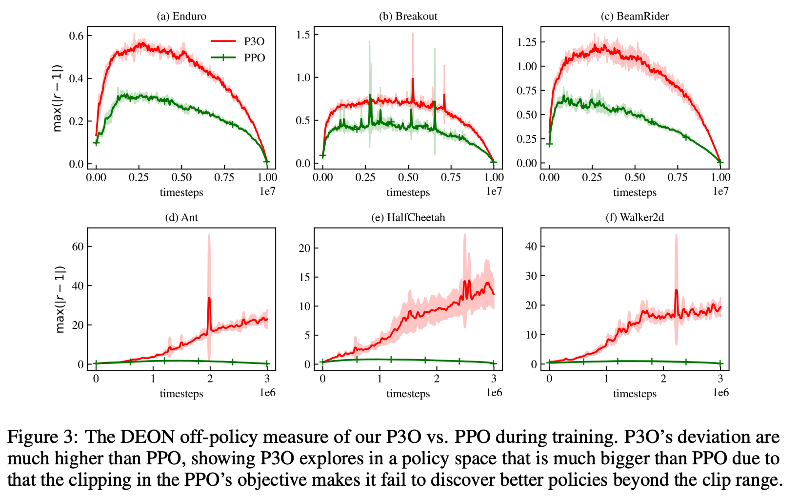
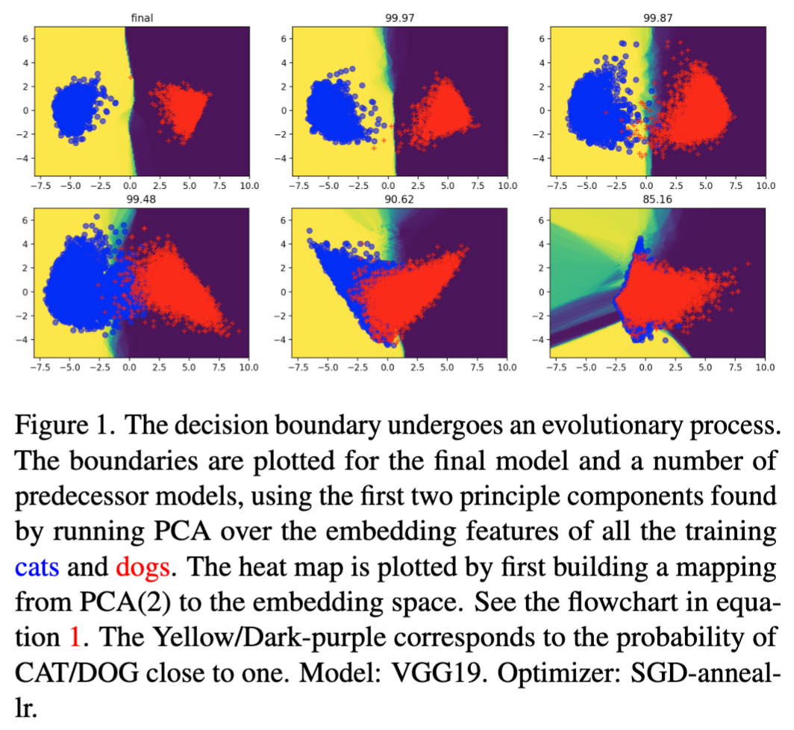
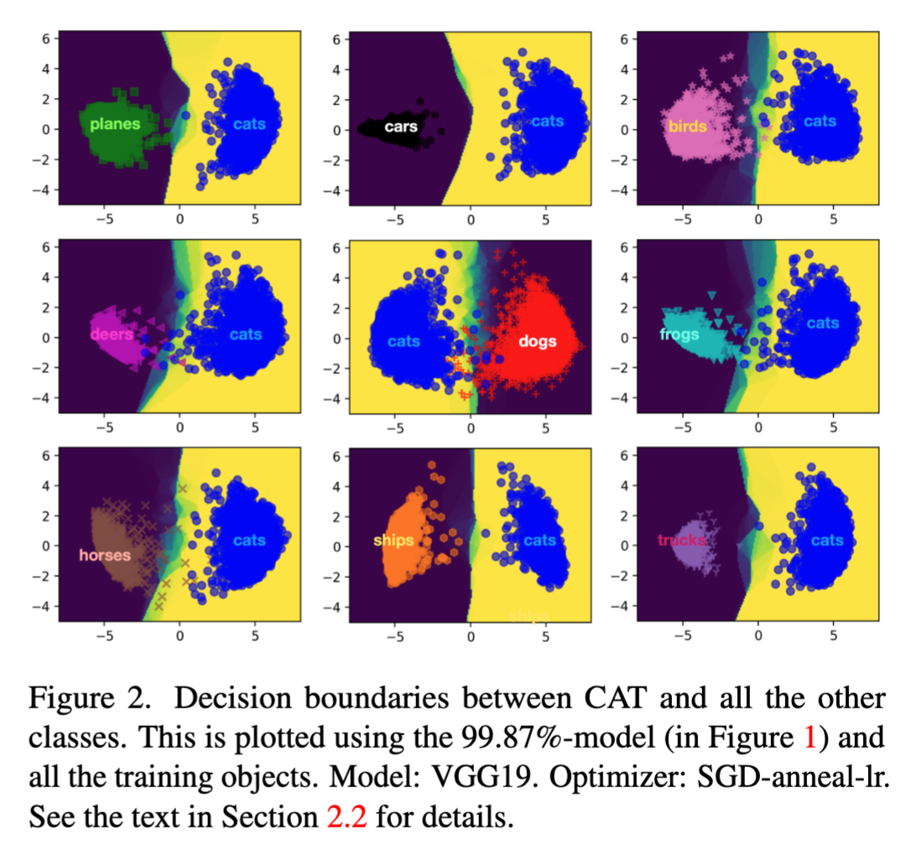
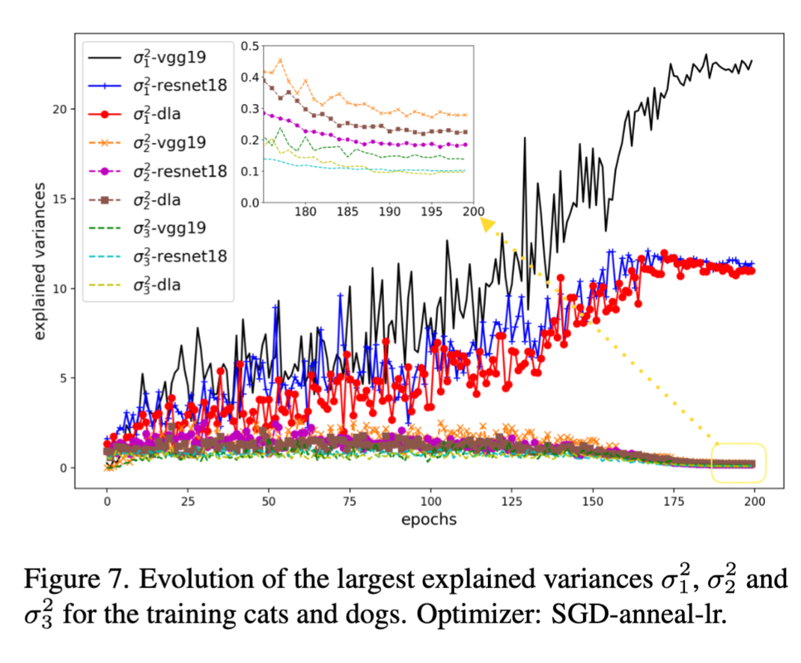
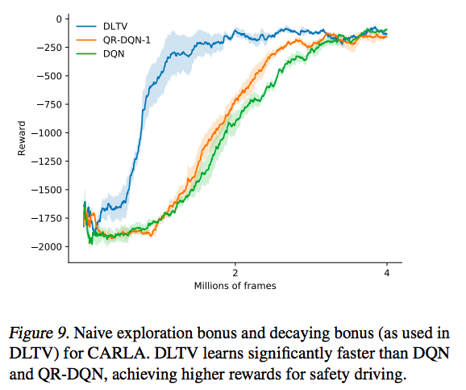
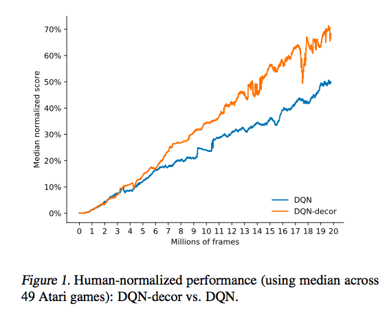
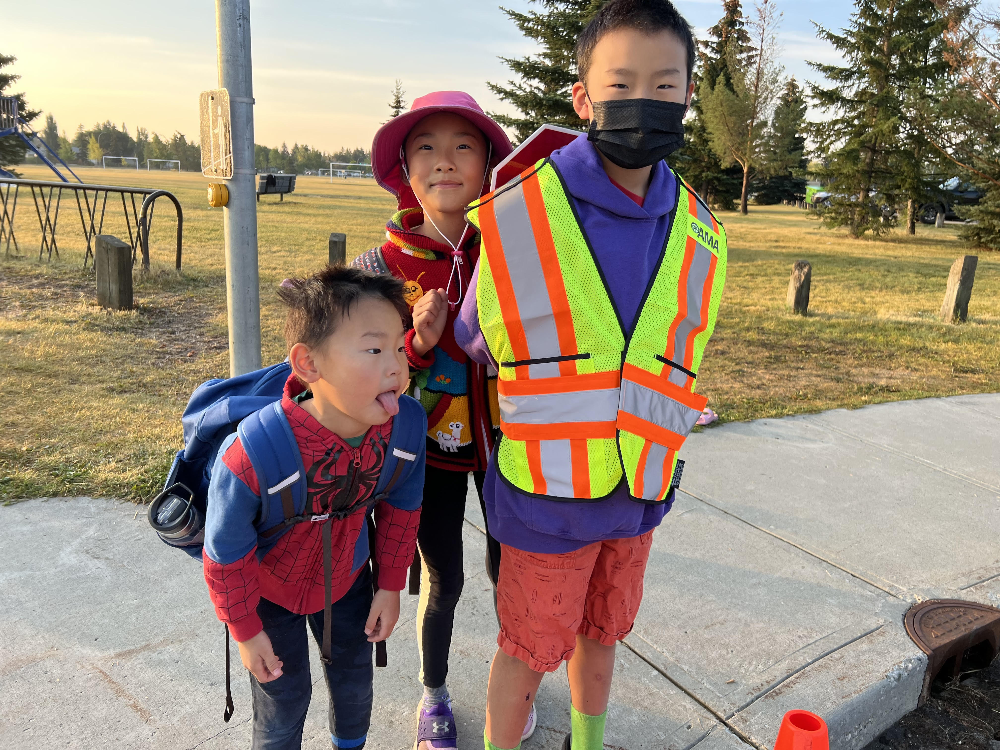

Latest activities:

 - Ragentile Intelligence, Cofounder, on using RL for learning superintelligence. Announcement coming soon.
 - ICLR 2027 Area Chair.
 - AAAI 2027 reviewer.
 - Neurips 2027 Area Chair.
 - ICML 2027 Area Chair.

## Research Interests
**Model-based reinforcement learning**.

I worked on multi-step linear Dyna-style planning, model-based approximate policy iteration, and a reinforcement learning perspective for PageRank. I explored RL for NCSoft game studio in San Francisco. I was founding PM of joint lab projects between UAlberta and Huawei Canada, mentored 20 graduate students, and served as adjunct professor at UAlberta. I was principal researcher at Noah's Ark (leading Planning team for Huawei global autonomous driving) and Hisilicon (chipset operator acceleration).

The foundational patent filed in 2017 ([US20190101917A1](https://patents.google.com/patent/US20190101917A1/en)) introduced **model‑based planning** for RL. This philosophy was commercially validated in 2025 via Huawei ADS 4.0 **WEWA** architecture (World Engine + World Action Model), as documented in [Huawei 2025 Annual Report](https://www-file.huawei.com/dam/asset/view/dec782afd1544f558c32fc76e3141334.pdf) (p.66). Industry analysis ([EEWorld](https://www.eeworld.com.cn/qcdz/eic695593.html)) confirms the World Action Model explicitly uses RL, mirroring my approach from eight years ago. This confirms that **AI decision‑making must be grounded in a learnable world model** – a paradigm I now aim to transfer to embodied intelligence for general‑purpose agents.

[My google scholar](https://scholar.google.ca/citations?user=R_wcnUgAAAAJ&hl=en)

There is a connection between model-based RL and step-size adaptation; see "Learning to Accelerate" below.

## Lifelong Acknowledgement
I am thankful to Csaba my supervisor and lifelong friend to his great family, and a role model. I appreciate Dr. Richard S. Sutton's TD paper which sparked my research interest, and his linear Dyna still inspires me. I am grateful for his acceptance as Ph.D student. Dale, for helping me with my idea of Reinforcement rank, and Andy Barto for his kindness and support on the preconditioning paper – he recommended me to UAlberta. My Tsinghua supervisor, Zengqi Sun (a well-known automatic control scholar and the founder of of Chinese Robocup event), and supported my RL exploration. Dimitri Bertsekas, for his encouragement and scholar influence.

---

### Publications

---

### Learning to Accelerate by the Methods of Step-size Planning
**Hengshuai Yao**  
*2022*  
[[arXiv](https://arxiv.org/abs/2204.01705)]

We present a data perspective for gradient descent, treating step‑sizes as a multi‑step transition model. Diagonal step‑size matrices have the same projection power as full matrices (O(n) vs O(n²)), allowing exact acceleration. Negative step‑sizes can benefit both deterministic and stochastic settings.

---

### Understanding and Mitigating the Limitations of Prioritized Replay
Yangchen Pan, Jincheng Mei, Amir-massoud Farahmand, Martha White, **Hengshuai Yao**, Mohsen Rohani, Jun Luo  
*UAI 2022*  
[[OpenReview](https://openreview.net/pdf?id=HBlNGvIicg9)]

We identify fundamental limitations of prioritized replay, including biased updates and reduced sample diversity. We propose a correction method that mitigates these biases while preserving the efficiency gains of prioritization. Experiments demonstrate improved performance and stability over standard prioritized replay across several domains.

---

### Exploring Neural Architecture Search Space via Deep Deterministic Sampling
Keith G. Mills, Mohhamad Salameh, Di Niu, Fred X. Han, Seyed Rezaei, **Hengshuai Yao**, Shangling Jui  
*IEEE Access, 2021*  
[[IEEE](https://ieeexplore.ieee.org/stamp/stamp.jsp?tp=&arnumber=9503404)]

We introduce Deep Deterministic Sampling, a novel approach for efficient neural architecture search. It leverages deterministic policies to navigate the search space, drastically reducing the number of sampled architectures. Our method achieves competitive accuracy with significantly lower computational cost compared to stochastic sampling baselines.

---

### Breaking the Deadly Triad with a Target Network
Shangtong Zhang, **Hengshuai Yao**, Shimon Whiteson  
*ICML 2021*  
[[arXiv](https://arxiv.org/abs/2101.08862)]

The "deadly triad" of off-policy learning, function approximation, and bootstrapping is known to cause instability and divergence. We prove that using a target network effectively breaks this triad, guaranteeing convergence under standard linear function approximation settings. Our analysis provides a new theoretical foundation for the empirical success of target networks in deep RL.

---

### Provably Convergent Two-Timescale Off-Policy Actor-Critic with Function Approximation
Shangtong Zhang, Bo Liu, **Hengshuai Yao**, Shimon Whiteson  
*ICML 2020*  
[[arXiv](https://arxiv.org/abs/1911.04384)]

We propose a novel off-policy actor-critic algorithm that operates on two timescales and provably converges with linear function approximation. The fast timescale updates the critic while the slow timescale updates the actor, ensuring stability. We validate the theoretical guarantees on standard benchmark tasks, showing robust performance.

---

### Weakly Guided Few-shot Object Segmentation using Co-Attention with Visual and Semantic Inputs
Mennatullah Siam, Naren Doraiswamy, Boris N. Oreshkin, **Hengshuai Yao**, Martin Jagersand  
*IJCAI 2020*  
[[arXiv](https://arxiv.org/abs/2001.09540)]

We tackle few-shot object segmentation by proposing a co-attention mechanism that fuses visual features with semantic word embeddings. This guidance allows the model to focus on relevant regions even with limited labeled support images. Our approach achieves state-of-the-art results on standard few-shot segmentation benchmarks.

---

### The Sufficiency of Off-policyness: PPO is still insufficient according to an Off-policy Measure
Xing Chen, Dongcui Diao, Hechang Chen, **Hengshuai Yao**, Jielong Yang, Haiyin Piao, Zhixiao Sun, Randy Goebel, Bei Jiang, Yi Chang  
*AAAI 2023*  
[[PDF](https://arxiv.org/pdf/2205.10047.pdf)]

PPO’s clipping fails to allow large importance ratios that better policies may require (20–60× deviations). We propose P3O to tame ratios while maintaining low variance and stability – an exploration method for continuous RL where counting‑based methods don’t apply.

### Thin Keys, Full Values: Reducing KV Cache via Low‑Dimensional Attention Selection
**Hengshuai Yao**, Xing Chen, Ahmed Murtadha, Guan Wang.
*2026*  
[[arXiv](https://arxiv.org/abs/2603.04427)] [[PDF](https://arxiv.org/pdf/2603.04427)]

Attention selection needs only O(log N) dimensions, far fewer than value transfer. We factor keys via SVD, absorbing into queries, to shrink KV cache of any pretrained model – achieving 75% key savings at ~2% quality cost, enabling ~60% more concurrent users at 128K context.

---

### Why Attend to Everything? Focus is the Key
**Hengshuai Yao**, Xing Chen, Ahmed Murtadha, Jin Li, Yasin Abbasi Yadkori, Shuai Shao, Changling Liu, Guan Wang, Mingli Yuan, William Chen, Sen Song  
*2026*  
[[arXiv](https://arxiv.org/abs/2604.03260)] [[PDF](https://arxiv.org/pdf/2604.03260)]

Focus learns which token pairs matter via learnable centroids (148K params/layer) – it composes onto any pretrained model with zero downstream degradation from 124M to 70B, outperforming full attention at 124M scale (30.3 vs 31.4 PPL). It delivers 2× speedup with better quality, and 8.6× at 1M tokens via FlashAttention decomposition, without custom kernels.

---

### The Vanishing Decision Boundary Complexity and the Strong First Component
**Hengshuai Yao**  
*2022*  
[[arXiv](https://arxiv.org/abs/2211.16209)]

Traditional wisdom says overfitting leads to complex decision boundaries. For well‑trained deep models, however, decision boundaries become perfectly linear (in PCA space) despite 100% training accuracy – so the boundary‑complexity vs generalization link breaks. Instead, the strength of the first principal component correlates with generalization. Videos below show class separation along PC1.

**Decision boundary evolution (VGG19):**

CAT–PLANE:

<iframe width="678" height="381" src="https://www.youtube.com/embed/-jnh5Bo9sTQ" frameborder="0" allowfullscreen></iframe>

CAT–DOG:

<iframe width="678" height="381" src="https://www.youtube.com/embed/OA7fCDpL5Rc" frameborder="0" allowfullscreen></iframe>

**ResNet18:**

CAT–PLANE:

<iframe width="678" height="381" src="https://www.youtube.com/embed/Ks93drvvEDE" frameborder="0" allowfullscreen></iframe>

CAT–DOG:

<iframe width="678" height="381" src="https://www.youtube.com/embed/jH3EGZM2mWI" frameborder="0" allowfullscreen></iframe>

**Adam optimizer (VGG19 & ResNet18):**

CAT–DOG (VGG19, Adam):

<iframe width="678" height="381" src="https://www.youtube.com/embed/BEIRoP2dBIo" frameborder="0" allowfullscreen></iframe>

CAT–DOG (ResNet18, Adam):

<iframe width="678" height="381" src="https://www.youtube.com/embed/21MpKOnlF98" frameborder="0" allowfullscreen></iframe>

The first singular value strength correlates with generalization – VGG19 has larger first singular value than better‑generalizing ResNet18 and DLA.

---

---

### Mapless Navigation among Dynamics with Social-safety-awareness: a reinforcement learning approach from 2D laser scans
Jun Jin, Nhat M. Nguyen, Nazmus Sakib, Daniel Graves, **Hengshuai Yao**, Martin Jagersand  
*ICRA 2020, Paris*  
[[arXiv](https://arxiv.org/abs/1911.03074)]

We present a RL-based framework for mapless navigation in dynamic environments using only 2D laser scans. The policy integrates a social-safety-awareness module to avoid collisions with moving pedestrians. Experiments in simulated and real-world scenarios demonstrate effective, collision-free navigation.

<iframe width="678" height="381" src="https://www.youtube.com/embed/SJYDiNjwYSQ" frameborder="0" allowfullscreen></iframe>

---

### Hill-climbing on Value Estimates for Search-control in Dyna
Yangchen Pan, **Hengshuai Yao**, Amir Masoud Farahmand, Martha White  
*IJCAI 2019, Macau*  
[[PDF](https://webdocs.cs.ualberta.ca/~whitem/publications/pan2019hill.pdf)]

We propose a hill-climbing method for search-control in Dyna architectures by directly optimizing over value estimates to select which simulated experiences to generate. This improves the computational efficiency of planning while maintaining policy quality. The approach offers a lightweight, computationally cheaper alternative to more expensive tree-based planning methods.

---

### Distributional Reinforcement Learning for Efficient Exploration
Borislav Mavrin, Shangtong Zhang, **Hengshuai Yao**, Linglong Kong, Kaiwen Wu, Yaoliang Yu  
*ICML 2019, Long Beach*  
[[arXiv](https://arxiv.org/abs/1905.06125)]

We use the learned value distribution to construct confidence intervals for exploration, achieving faster learning (DLTV) in CARLA than QR-DQN – a practical use of distributional RL beyond mean estimation.

---

### Deep Reinforcement Learning with Decorrelation
Borislav Mavrin, **Hengshuai Yao**, Linglong Kong  
*2019*  
[[arXiv](https://arxiv.org/abs/1903.07765)]

We show that feature correlations in deep RL can harm learning efficiency and stability. We propose a regularization term that decorrelates features during training, improving sample complexity and final performance on several Atari games. This method is orthogonal to existing DQN variants and can be easily integrated with them.

---

### Reinforcing Classical Planning for Adversary Driving Scenarios
Nazmus Sakib, **Hengshuai Yao**, Hong Zhang  
*Preprint 2019*  
[[PDF](papers/iros_final.pdf)]

We combine classical planning with reinforcement learning to handle adversary driving scenarios. The RL component learns robust policies in complex, dynamic environments while leveraging classical planners for safety-critical constraints. Experimental results validate the effectiveness of the hybrid approach in simulated adversarial situations.

<iframe align="middle" width="750" height="400" src="https://www.youtube.com/embed/9BFYX1WRjtA" frameborder="0" allowfullscreen></iframe>

---

### Exploration in the face of Parametric and Intrinsic Uncertainties
Borislav Mavrin, Shangtong Zhang, **Hengshuai Yao**, Linglong Kong  
*AAMAS (poster) 2019, Montreal*  
[[PDF](papers/dltv_aamas19.pdf)]

We study the exploration problem in the presence of both parametric and intrinsic uncertainties. The proposed method combines count-based exploration with uncertainty estimation to improve sample efficiency. It shows robust performance on both continuous control tasks and tabular settings.

---

### ACE: An Actor Ensemble Algorithm for Continuous Control with Tree Search
Shangtong Zhang, Hao Chen, **Hengshuai Yao**  
*AAAI 2019, Honolulu*  
[[arXiv](https://arxiv.org/abs/1811.02696)]

We propose ACE, a novel algorithm combining an ensemble of actors with tree search for continuous control. The ensemble reduces variance in policy gradients while tree search refines action selection via look-ahead planning. This approach achieves state-of-the-art performance on challenging MuJoCo environments.

---

### QUOTA: The Quantile Option Architecture for Reinforcement Learning
Shangtong Zhang, Borislav Mavrin, Linglong Kong, Bo Liu, **Hengshuai Yao**  
*AAAI 2019 (Oral), Honolulu*  
[[arXiv](https://arxiv.org/abs/1811.02073)]

QUOTA extends quantile temporal-difference learning by integrating it with the options framework. It learns a set of quantile options, allowing richer hierarchical exploration and decision-making across multiple time scales. Experiments demonstrate improved performance over standard options and quantile methods.

---

### Negative Log Likelihood Ratio Loss for Deep Neural Network Classification
**Hengshuai Yao**, Donglai Zhu, Bei Jiang, Peng Yu  
*FTC 2019, San Francisco*  
[[arXiv](https://arxiv.org/pdf/1804.10690.pdf)]

We propose a novel loss function for classification, the Negative Log Likelihood Ratio (NLLR) loss, which directly penalizes inter-class confusion. NLLR improves discriminative power on hard samples compared to standard cross-entropy. We demonstrate its superiority on multiple image classification datasets.

---

### Towards Comprehensive Maneuver Decisions for Lane Change Using Reinforcement Learning
C. Chen, J. Qian, **H. Yao**, J. Luo, H. Zhang, W. Liu  
*NIPS Workshop MLITS 2018*  
[[OpenReview](https://openreview.net/forum?id=SJe9yugRcm)]

We apply reinforcement learning to comprehensive lane-change decision-making for autonomous driving. The policy learns safe and efficient lane-changing behavior in highway environments while dealing with dynamic traffic flows. Preliminary experiments demonstrate the superiority of the learning-based approach over rule-based heuristics.

---

### Monte-Carlo Tree Search vs. Model-Predictive Controller: A Track-Following Example
**H. Yao**, M. Nasrati, K. Rezaee  
*NIPS Workshop MLITS 2017*  
[[OpenReview](https://openreview.net/forum?id=SyiF5-23Z&noteId=S1y46fu1M)]

We empirically compare Monte-Carlo Tree Search and Model-Predictive Control on a track-following task. Our analysis shows that MCTS can offer performance advantages over traditional MPC under non-linear and uncertain dynamics. This study provides insights into the choice of real-time planning algorithms for autonomous driving.

<iframe align="center" width="630" height="474" src="https://www.youtube.com/embed/YP7qPJSJAVU" frameborder="0" allowfullscreen></iframe>

---

### Practical Issues of Action-conditioned Next Image Prediction
D. Zhu, H. Chen, **H. Yao**, M. Nosrati, P. Yadmellat, Y. Zhang  
*ITSC 2018*  
[[arXiv](https://arxiv.org/abs/1802.02975)]

We investigate practical challenges in action-conditioned next image prediction, such as prediction ambiguity and compounding errors. We propose mitigation strategies to stabilize training and improve prediction quality. Our findings are critical for model-based visual RL applications.

---

### Pseudo-MDPs and Factored Linear Action Models
**H. Yao**, Cs. Szepesvári, B. A. Pires, X. Zhang  
*IEEE ADPRL 2014 (Best student paper nomination), Orlando*  
[[PDF](papers/pmdp.pdf)]

We introduce the Pseudo-MDP framework along with Factored Linear Action Models (LAM) for efficient generalization in high-dimensional state spaces. The model approximates transition dynamics via linear factors, enabling efficient planning. The method demonstrates strong sample efficiency and planning capabilities in several simulated environments.

---

### Universal Option Models
**H. Yao**, Cs. Szepesvári, R. Sutton, S. Bhatnagar  
*NIPS 2014, Montreal*  
[[PDF](papers/uom.pdf)]

We propose Universal Option Models (UOMs) for learning transferable options in reinforcement learning. UOMs predict the outcome state after an option terminates via a low-rank approximation of the option's internal dynamics. This enables effective transfer learning and accelerates planning in new tasks.

---

### A System to Predict Future Popularity: Learning to Classify
C. Lee, **H. Yao**, X. He, C. Su, J-Y. Chang  
*WWW (poster) 2014, Seoul*  

We build a system to predict the future popularity of search engine queries. The system classifies time-series patterns into different growth categories, powering Yahoo's "TrendingNow" feature. This approach enables precise bursty topic detection from early-stage data.

---

### A Study of Temporal Citation Count Prediction using Reinforcement Learning
**H. Yao**, R. Sutton, D. Rafiei  
*2014*  
[[PDF](papers/citation.pdf)]

We model citation count prediction as a temporal decision problem and use reinforcement learning to optimize the prediction policy. The model learns to adaptively integrate the influence of past citation trends. Results demonstrate improved prediction accuracy over standard regression baselines.

---

### Reinforcement Ranking
**H. Yao**, D. Schuurmans  
*2013*  
[[PDF](papers/rr.pdf)]

We propose a reinforcement learning approach for ranking, directly optimizing the ranked list for information retrieval. The policy optimizes long-term cumulative gains rather than single-step relevance. This allows the model to learn more robust and adaptive ranking strategies.

---

### Approximate Policy Iteration with Linear Action Models
**H. Yao**, Cs. Szepesvári  
*AAAI 2012, Toronto*  
[[PDF](papers/lamapi.pdf)]

We develop an approximate policy iteration algorithm for problems with large action spaces using Linear Action Models (LAMs). LAMs efficiently predict the next state and reward given the current state and action. The algorithm demonstrates convergence and effectiveness on classic RL benchmarks.

---

### MaxRank: Discovering and Leveraging the Most Valuable Links for Ranking
**H. Yao**  
*2012*  
[[PDF](papers/maxrank.pdf)]

We study the problem of discovering and leveraging the most valuable links in web graphs for ranking. The method optimizes link weights based on their contribution to overall network structure. It provides a new way to improve convergence speed and accuracy of ranking algorithms like PageRank.

---

### Linear least-squares Dyna-style planning
**H. Yao**  
*Technical Report TR11-04, UAlberta, 2011*

We propose a least-squares Dyna planning algorithm for linear function approximation settings. The algorithm efficiently learns the transition model from simulated experience via least-squares regression. This paves the way for efficient and scalable planning in online settings.

---

### Off-policy learning with linear action models: an efficient "One-Collection-For-All-Solution"
**H. Yao**  
*ICML Workshop on Planning and Acting with Uncertain Models, 2011*  
[[PDF](papers/one_collection_for_all.pdf)]

We introduce a "One-Collection-For-All" framework for off-policy learning with linear action models. This framework enables efficient evaluation of multiple target policies using data from a single behavior policy. It significantly reduces the data collection cost for off-policy evaluation.

---

### Dyna(k): A multi-step Dyna planning
**H. Yao**, R. S. Sutton, S. Bhatnagar, D. Diao, Cs. Szepesvári  
*ICML Workshop on Abstraction in RL, 2009, Montreal*

We extend the Dyna architecture with multi-step lookahead. Instead of one-step simulations, Dyna(k) simulates k steps of the transition model to generate deeper planning data. This simple extension leads to faster policy convergence on several benchmark tasks.

---

### Multi-step linear Dyna-style planning
**H. Yao**, S. Bhatnagar, D. Diao  
*NIPS 2009, Vancouver*

We extend linear Dyna planning to multi-step lookahead. By simulating multiple steps, the algorithm captures long-term dynamics more accurately, improving policy estimation. Experiments verify its superior efficiency over the one-step counterpart.

---

### LMS-2: towards an algorithm that is as cheap as LMS and almost as efficient as RLS
**H. Yao**, S. Bhatnagar, Cs. Szepesvári  
*CDC 2009, Shanghai*

We propose LMS-2, an adaptive filtering algorithm combining the computational efficiency of LMS with the faster convergence of RLS. The algorithm achieves this through a multi-step update scheme. Theoretical analysis and simulations confirm its superior tracking performance.

---

### Temporal difference learning by direct preconditioning
**H. Yao**, S. Bhatnagar, Cs. Szepesvári  
*MSRL 2009, Montreal*  
[[PDF](papers/direct_preconditioning.pdf)]

We propose a direct preconditioning method to accelerate temporal difference learning. By applying a preconditioning matrix, we significantly reduce the condition number of the gradient updates. This effectively mitigates the slow convergence commonly observed in TD methods.

---

### Preconditioned temporal difference learning
**H. Yao**, Z-Q. Liu  
*ICML 2008, Helsinki*  
[[PDF](papers/ptd.pdf)]

We introduce Preconditioned TD (PTD), which applies a parameter-space transformation to accelerate learning in RL. The preconditioner approximates the inverse covariance of the TD update direction. PTD shows significantly faster convergence than standard TD on several tasks, including stochastic optimal control problems.

---

### Minimal residual approaches for policy evaluation in large sparse Markov chains
**H. Yao**, Z-Q. Liu  
*ISAIM 2008, Fort Lauderdale*  
[[PDF](papers/mr.pdf)]

We apply minimal residual methods to policy evaluation in large sparse Markov chains. By directly optimizing the Bellman residual, we provide a stable alternative to LSTD. The algorithm is computationally more efficient and scales well to high-dimensional problems.

---

### Education
* Ph.D, Computing Science, University of Alberta, 2008–2014
* M.E, Computer Science, Tsinghua University, 2003–2006
* B.S, Mathematics, Shandong University of Technology, 1999–2003
* Zhaoyuan 1st Middle School, 1996–1999

### Thesis
- Model-based Reinforcement Learning with State and Action Abstractions – [PhD thesis](papers/yao_hengshuai_PhD.pdf), defended 2015.

### Volunteer service
- Reviewer for AAAI, ICML, NIPS, UAI, AIStat, ADPRL, CIKM, WWW; ICML'22 Outstanding reviewer.
- Parent volunteering at Westbrook public school and Confed Hockey club.

---

## Robocup Soccer
Member of TsinghuAeolus (soccer simulation) – Robocup 2003 final match. High‑level and low‑level controllers learned via RL.

<video src="videos/2d simulation game short.mp4" width="640" height="400" autoplay controls preload></video>

## Tetris
Policy iteration playing Tetris with only hard shapes (S, Z), trained on random play data.

<video src="videos/SZ tetris game short.mp4" width="640" height="400" autoplay controls preload></video>

---

### Scholars/Engineers Collaborated with
- Shangtong Zhang (now prof at UVA) – mentored 2018
- Mennatullah Siam (postdoc York) – mentored 2019
- Khuram Javed (Now Cofounder of Oak Lab) – mentored 2019. 
- Chao Gao (now principal researcher at Huawei Edmonton) – mentored 2019–2020
- Abhishek Naik – mentored 2019
- Yangchen Pan (Lecturer of Oxford) – mentored 2019
- Yi Liu – mentored 2019
- Nazmus Sakib (graduated 2020, co‑supervised with Hong Zhang)
- Arash Pourzarabi – deeply missed him (PS752).

---

### Contact
hengshu1@ualberta.ca

为人师者, 必先正其身。德之未至，未敢为人师。

恒帅。
