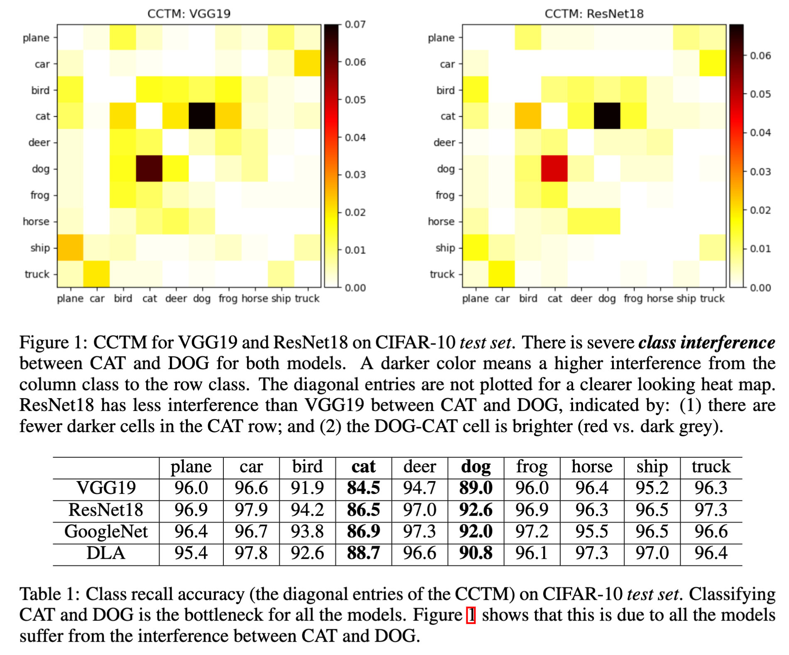
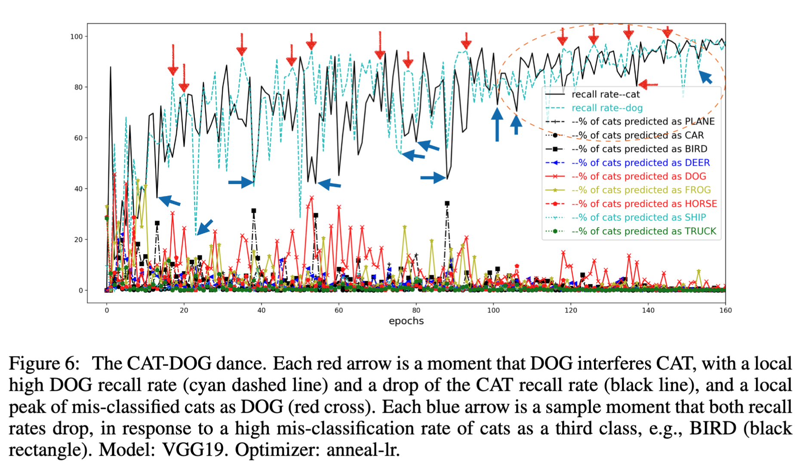

Latest activities:

 - Ragentile Intelligence, Cofounder, on using RL for learning superintelligence. Announcement coming soon.
 - ICLR 2027 Area Chair.
 - AAAI 2027 reviewer.
 - Neurips 2027 Area Chair.
 - ICML 2027 Area Chair.

## Research Interests
**Model-based reinforcement learning**.

I worked on multi-step linear Dyna-style planning, model-based approximate policy iteration, and a reinforcement learning perspective for PageRank. I explored RL for NCSoft game studio in San Francisco. I was founding PM of joint lab projects between UAlberta and Huawei Canada, mentored 20 graduate students, and served as adjunct professor at UAlberta. I was principal researcher at Noah's Ark (leading Planning team for Huawei global autonomous driving) and Hisilicon (chipset operator acceleration).

The foundational patent filed in 2017 ([US20190101917A1](https://patents.google.com/patent/US20190101917A1/en)) introduced **model‑based planning** for RL. This philosophy was commercially validated in 2025 via Huawei ADS 4.0 **WEWA** architecture (World Engine + World Action Model), as documented in [Huawei 2025 Annual Report](https://www-file.huawei.com/dam/asset/view/dec782afd1544f558c32fc76e3141334.pdf) (p.66). Industry analysis ([EEWorld](https://www.eeworld.com.cn/qcdz/eic695593.html)) confirms the World Action Model explicitly uses RL, mirroring my approach from eight years ago. This confirms that **AI decision‑making must be grounded in a learnable world model** – a paradigm I now aim to transfer to embodied intelligence for general‑purpose agents.

[My google scholar](https://scholar.google.ca/citations?user=R_wcnUgAAAAJ&hl=en)

There is a connection between model-based RL and step-size adaptation; see "Learning to Accelerate" below.

## Lifelong Acknowledgement
I deeply appreciate Dr. Richard S. Sutton – his TD paper sparked my research interest, and his linear Dyna still inspires me. I am grateful for his acceptance as my Ph.D supervisor. I also thank Csaba and Dale for helping me through hard times, and Andy Barto for his kindness and support on the preconditioning paper – he recommended me to UAlberta despite never meeting me. My Tsinghua supervisor, Zengqi Sun, always supported my RL exploration.

---

### Publications

### Thin Keys, Full Values: Reducing KV Cache via Low‑Dimensional Attention Selection
**Hengshuai Yao**, Guan Wang, Xing Chen, Ahmed Murtadha  
*2026*  
[[arXiv](https://arxiv.org/abs/2603.04427)] [[PDF](https://arxiv.org/pdf/2603.04427)]

Attention selection needs only O(log N) dimensions, far fewer than value transfer. We factor keys via SVD, absorbing into queries, to shrink KV cache of any pretrained model – achieving 75% key savings at ~2% quality cost, enabling ~60% more concurrent users at 128K context.

---

### Why Attend to Everything? Focus is the Key
**Hengshuai Yao**, Xing Chen, Ahmed Murtadha, Jin Li, Yasin Abbasi Yadkori, Shuai Shao, Changling Liu, Guan Wang, Mingli Yuan, William Chen, Sen Song  
*2026*  
[[arXiv](https://arxiv.org/abs/2604.03260)] [[PDF](https://arxiv.org/pdf/2604.03260)]

Focus learns which token pairs matter via learnable centroids (148K params/layer) – it composes onto any pretrained model with zero downstream degradation from 124M to 70B, outperforming full attention at 124M scale (30.3 vs 31.4 PPL). It delivers 2× speedup with better quality, and 8.6× at 1M tokens via FlashAttention decomposition, without custom kernels.

---

### From 25% to 3% Tokens: Breaking the Sparse Attention Barrier (ARTS)
**Hengshuai Yao**, Guan Wang, Xing Chen, Ahmed Murtadha  
*2026*  
[[arXiv](https://arxiv.org/abs/2604.04516)] [[PDF](https://arxiv.org/pdf/2604.04516)]

ARTS shows that extreme sparse attention fails due to softmax re‑normalization, not token loss. It replaces re‑normalization with learned per‑head and per‑dimension scaling, achieving 3% tokens within 1‑2 PPL points of full attention. A fused Triton kernel gives 56.5× speedup at 1M context, scaling where full attention OOMs at 128K.

---

### Why Extremely Sparse Attention Failed: Sparse Inference via Learned Scaling
**Hengshuai Yao**, Xing Chen, Ahmed Murtadha, Guan Wang  
*2026*  
*Preprint* (PDF: `arts_gain.pdf`)

We pinpoint re‑normalization as the cause of failure and propose ARTS with per‑dimension scaling and per‑head bias. ARTS preserves quality within 1–2 PPL points at 3% tokens, keeps downstream accuracy within noise, delivers 6.9× end‑to‑end speedup at 64K, and scales to 1M with length‑portable calibration and strong needle retrieval.

---

### The Sufficiency of Off-policyness: PPO is still insufficient according to an Off-policy Measure
Xing Chen, Dongcui Diao, Hechang Chen, **Hengshuai Yao**, Jielong Yang, Haiyin Piao, Zhixiao Sun, Randy Goebel, Bei Jiang, Yi Chang  
*AAAI 2023*  
[[PDF](https://arxiv.org/pdf/2205.10047.pdf)]

PPO’s clipping fails to allow large importance ratios that better policies may require (20–60× deviations). We propose P3O to tame ratios while maintaining low variance and stability – an exploration method for continuous RL where counting‑based methods don’t apply.

---

### The Vanishing Decision Boundary Complexity and the Strong First Component
**Hengshuai Yao**  
*2022*  
[[arXiv](https://arxiv.org/abs/2211.16209)]

Traditional wisdom says overfitting leads to complex decision boundaries. For well‑trained deep models, however, decision boundaries become perfectly linear (in PCA space) despite 100% training accuracy – so the boundary‑complexity vs generalization link breaks. Instead, the strength of the first principal component correlates with generalization. Videos below show class separation along PC1.

**Decision boundary evolution (VGG19):**

CAT–PLANE:

<iframe width="678" height="381" src="https://www.youtube.com/embed/-jnh5Bo9sTQ" frameborder="0" allowfullscreen></iframe>

CAT–DOG:

<iframe width="678" height="381" src="https://www.youtube.com/embed/OA7fCDpL5Rc" frameborder="0" allowfullscreen></iframe>

**ResNet18:**

CAT–PLANE:

<iframe width="678" height="381" src="https://www.youtube.com/embed/Ks93drvvEDE" frameborder="0" allowfullscreen></iframe>

CAT–DOG:

<iframe width="678" height="381" src="https://www.youtube.com/embed/jH3EGZM2mWI" frameborder="0" allowfullscreen></iframe>

**Adam optimizer (VGG19 & ResNet18):**

CAT–DOG (VGG19, Adam):

<iframe width="678" height="381" src="https://www.youtube.com/embed/BEIRoP2dBIo" frameborder="0" allowfullscreen></iframe>

CAT–DOG (ResNet18, Adam):

<iframe width="678" height="381" src="https://www.youtube.com/embed/21MpKOnlF98" frameborder="0" allowfullscreen></iframe>

The first singular value strength correlates with generalization – VGG19 has larger first singular value than better‑generalizing ResNet18 and DLA.

---

### Class Interference of Deep Neural Networks
Dongcui Diao, **Hengshuai Yao**, Bei Jiang  
*2022*  
[[arXiv](https://arxiv.org/abs/2211.01370)]

We identify **class interference** as the bottleneck – similar classes (CAT–DOG, CAR–TRUCK) interfere, causing most generalization errors. The CCTM metric visualizes this symmetry, and ResNet18 handles interference better than VGG19. This interference is the main source of error, even for human perception.

---

### Learning to Accelerate by the Methods of Step-size Planning
**Hengshuai Yao**  
*2022*  
[[arXiv](https://arxiv.org/abs/2204.01705)]

We present a data perspective for gradient descent, treating step‑sizes as a multi‑step transition model. Diagonal step‑size matrices have the same projection power as full matrices (O(n) vs O(n²)), allowing exact acceleration. Negative step‑sizes can benefit both deterministic and stochastic settings.

---

### Understanding and Mitigating the Limitations of Prioritized Replay
Yangchen Pan, Jincheng Mei, Amir-massoud Farahmand, Martha White, **Hengshuai Yao**, Mohsen Rohani, Jun Luo  
*UAI 2022*  
[[OpenReview](https://openreview.net/pdf?id=HBlNGvIicg9)]

---

### Exploring Neural Architecture Search Space via Deep Deterministic Sampling
Keith G. Mills, Mohhamad Salameh, Di Niu, Fred X. Han, Seyed Rezaei, **Hengshuai Yao**, Shangling Jui  
*IEEE Access, 2021*  
[[IEEE](https://ieeexplore.ieee.org/stamp/stamp.jsp?tp=&arnumber=9503404)]

---

### Breaking the Deadly Triad with a Target Network
Shangtong Zhang, **Hengshuai Yao**, Shimon Whiteson  
*ICML 2021*  
[[arXiv](https://arxiv.org/abs/2101.08862)]

---

### Provably Convergent Two-Timescale Off-Policy Actor-Critic with Function Approximation
Shangtong Zhang, Bo Liu, **Hengshuai Yao**, Shimon Whiteson  
*ICML 2020*  
[[arXiv](https://arxiv.org/abs/1911.04384)]

---

### Weakly Guided Few-shot Object Segmentation using Co-Attention with Visual and Semantic Inputs
Mennatullah Siam, Naren Doraiswamy, Boris N. Oreshkin, **Hengshuai Yao**, Martin Jagersand  
*IJCAI 2020*  
[[arXiv](https://arxiv.org/abs/2001.09540)]

---

### Mapless Navigation among Dynamics with Social-safety-awareness: a reinforcement learning approach from 2D laser scans
Jun Jin, Nhat M. Nguyen, Nazmus Sakib, Daniel Graves, **Hengshuai Yao**, Martin Jagersand  
*ICRA 2020, Paris*  
[[arXiv](https://arxiv.org/abs/1911.03074)]

<iframe width="678" height="381" src="https://www.youtube.com/embed/SJYDiNjwYSQ" frameborder="0" allowfullscreen></iframe>

---

### Hill-climbing on Value Estimates for Search-control in Dyna
Yangchen Pan, **Hengshuai Yao**, Amir Masoud Farahmand, Martha White  
*IJCAI 2019, Macau*  
[[PDF](https://webdocs.cs.ualberta.ca/~whitem/publications/pan2019hill.pdf)]

---

### Distributional Reinforcement Learning for Efficient Exploration
Borislav Mavrin, Shangtong Zhang, **Hengshuai Yao**, Linglong Kong, Kaiwen Wu, Yaoliang Yu  
*ICML 2019, Long Beach*  
[[arXiv](https://arxiv.org/abs/1905.06125)]

We use the learned value distribution to construct confidence intervals for exploration, achieving faster learning (DLTV) in CARLA than QR-DQN – a practical use of distributional RL beyond mean estimation.

---

### Deep Reinforcement Learning with Decorrelation
Borislav Mavrin, **Hengshuai Yao**, Linglong Kong  
*2019*  
[[arXiv](https://arxiv.org/abs/1903.07765)]

---

### Reinforcing Classical Planning for Adversary Driving Scenarios
Nazmus Sakib, **Hengshuai Yao**, Hong Zhang  
*Preprint 2019*  
[[PDF](papers/iros_final.pdf)]

<iframe align="middle" width="750" height="400" src="https://www.youtube.com/embed/9BFYX1WRjtA" frameborder="0" allowfullscreen></iframe>

---

### Exploration in the face of Parametric and Intrinsic Uncertainties
Borislav Mavrin, Shangtong Zhang, **Hengshuai Yao**, Linglong Kong  
*AAMAS (poster) 2019, Montreal*  
[[PDF](papers/dltv_aamas19.pdf)]

---

### ACE: An Actor Ensemble Algorithm for Continuous Control with Tree Search
Shangtong Zhang, Hao Chen, **Hengshuai Yao**  
*AAAI 2019, Honolulu*  
[[arXiv](https://arxiv.org/abs/1811.02696)]

---

### QUOTA: The Quantile Option Architecture for Reinforcement Learning
Shangtong Zhang, Borislav Mavrin, Linglong Kong, Bo Liu, **Hengshuai Yao**  
*AAAI 2019 (Oral), Honolulu*  
[[arXiv](https://arxiv.org/abs/1811.02073)]

---

### Negative Log Likelihood Ratio Loss for Deep Neural Network Classification
**Hengshuai Yao**, Donglai Zhu, Bei Jiang, Peng Yu  
*FTC 2019, San Francisco*  
[[arXiv](https://arxiv.org/pdf/1804.10690.pdf)]

---

### Towards Comprehensive Maneuver Decisions for Lane Change Using Reinforcement Learning
C. Chen, J. Qian, **H. Yao**, J. Luo, H. Zhang, W. Liu  
*NIPS Workshop MLITS 2018*  
[[OpenReview](https://openreview.net/forum?id=SJe9yugRcm)]

---

### Monte-Carlo Tree Search vs. Model-Predictive Controller: A Track-Following Example
**H. Yao**, M. Nasrati, K. Rezaee  
*NIPS Workshop MLITS 2017*  
[[OpenReview](https://openreview.net/forum?id=SyiF5-23Z&noteId=S1y46fu1M)]

<iframe align="center" width="630" height="474" src="https://www.youtube.com/embed/YP7qPJSJAVU" frameborder="0" allowfullscreen></iframe>

---

### Practical Issues of Action-conditioned Next Image Prediction
D. Zhu, H. Chen, **H. Yao**, M. Nosrati, P. Yadmellat, Y. Zhang  
*ITSC 2018*  
[[arXiv](https://arxiv.org/abs/1802.02975)]

---

### Pseudo-MDPs and Factored Linear Action Models
**H. Yao**, Cs. Szepesvári, B. A. Pires, X. Zhang  
*IEEE ADPRL 2014 (Best student paper nomination), Orlando*  
[[PDF](papers/pmdp.pdf)]

---

### Universal Option Models
**H. Yao**, Cs. Szepesvári, R. Sutton, S. Bhatnagar  
*NIPS 2014, Montreal*  
[[PDF](papers/uom.pdf)]

---

### A System to Predict Future Popularity: Learning to Classify
C. Lee, **H. Yao**, X. He, C. Su, J-Y. Chang  
*WWW (poster) 2014, Seoul*  

---

### A Study of Temporal Citation Count Prediction using Reinforcement Learning
**H. Yao**, R. Sutton, D. Rafiei  
*2014*  
[[PDF](papers/citation.pdf)]

---

### Reinforcement Ranking
**H. Yao**, D. Schuurmans  
*2013*  
[[PDF](papers/rr.pdf)]

---

### Approximate Policy Iteration with Linear Action Models
**H. Yao**, Cs. Szepesvári  
*AAAI 2012, Toronto*  
[[PDF](papers/lamapi.pdf)]

---

### MaxRank: Discovering and Leveraging the Most Valuable Links for Ranking
**H. Yao**  
*2012*  
[[PDF](papers/maxrank.pdf)]

---

### Linear least-squares Dyna-style planning
**H. Yao**  
*Technical Report TR11-04, UAlberta, 2011*

---

### Off-policy learning with linear action models: an efficient "One-Collection-For-All-Solution"
**H. Yao**  
*ICML Workshop on Planning and Acting with Uncertain Models, 2011*  
[[PDF](papers/one_collection_for_all.pdf)]

---

### Dyna(k): A multi-step Dyna planning
**H. Yao**, R. S. Sutton, S. Bhatnagar, D. Diao, Cs. Szepesvári  
*ICML Workshop on Abstraction in RL, 2009, Montreal*

---

### Multi-step linear Dyna-style planning
**H. Yao**, S. Bhatnagar, D. Diao  
*NIPS 2009, Vancouver*

---

### LMS-2: towards an algorithm that is as cheap as LMS and almost as efficient as RLS
**H. Yao**, S. Bhatnagar, Cs. Szepesvári  
*CDC 2009, Shanghai*

---

### Temporal difference learning by direct preconditioning
**H. Yao**, S. Bhatnagar, Cs. Szepesvári  
*MSRL 2009, Montreal*  
[[PDF](papers/direct_preconditioning.pdf)]

---

### Preconditioned temporal difference learning
**H. Yao**, Z-Q. Liu  
*ICML 2008, Helsinki*  
[[PDF](papers/ptd.pdf)]

---

### Minimal residual approaches for policy evaluation in large sparse Markov chains
**H. Yao**, Z-Q. Liu  
*ISAIM 2008, Fort Lauderdale*  
[[PDF](papers/mr.pdf)]

---

### Education
* Ph.D, Computing Science, University of Alberta, 2008–2014
* M.E, Computer Science, Tsinghua University, 2003–2006
* B.S, Mathematics, Shandong University of Technology, 1999–2003
* Zhaoyuan 1st Middle School, 1996–1999

### Thesis
- Model-based Reinforcement Learning with State and Action Abstractions – [PhD thesis](papers/yao_hengshuai_PhD.pdf), defended 2015.

### Volunteer service
- Reviewer for AAAI, ICML, NIPS, UAI, AIStat, ADPRL, CIKM, WWW; ICML'22 Outstanding reviewer.
- Parent volunteering at Westbrook public school and Confed Hockey club.

---

## Robocup Soccer
Member of TsinghuAeolus (soccer simulation) – Robocup 2003 final match. High‑level and low‑level controllers learned via RL.

<video src="videos/2d simulation game short.mp4" width="640" height="400" autoplay controls preload></video>

## Tetris
Policy iteration playing Tetris with only hard shapes (S, Z), trained on random play data.

<video src="videos/SZ tetris game short.mp4" width="640" height="400" autoplay controls preload></video>

---

### Students Collaborated with
- Shangtong Zhang (now prof at UVA) – mentored 2018
- Mennatullah Siam (postdoc York) – mentored 2019
- Khuram Javed – mentored 2019
- Chao Gao (now principal researcher at Huawei Edmonton) – mentored 2019–2020
- Abhishek Naik – mentored 2019
- Yangchen Pan – mentored 2019
- Yi Liu – mentored 2019
- Nazmus Sakib (graduated 2020, co‑supervised with Hong Zhang)
- Arash Pourzarabi – deeply missed (PS752).

---

### Contact
hengshu1@ualberta.ca

为人师者, 必先正其身。德之未至，未敢为人师。

恒帅。
