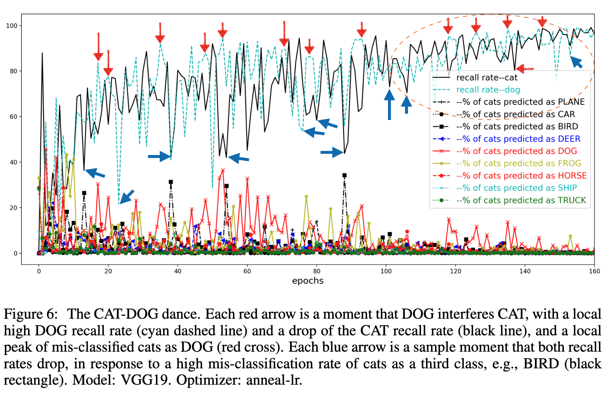

Hi, my name is Hengshuai Yao. I work at the awesome [Sony AI team](https://ai.sony/). 

My research has inspired [Gradient TD](https://sites.ualberta.ca/~szepesva/papers/gtdNeurIPS08.pdf) (Sutton, Maei and Szepesvari, 2008), [GTD2 and TDC](https://icml.cc/Conferences/2009/papers/546.pdf) (Sutton, Maei, Precup, Bhatnagar, Silver, and Szepesvari, Wiewiora, 2009). These two papers are widely acknowledged to stand for and start an important class of off-policy learning algorithms. 

However, my contributions were not recognized or credited by the literature for some reason. I was also part of the TDC paper development (for some reason my name was not on this paper though). 

Finally, after enormous mental struggles, I gave up holding on this. I wish the GTD and the TDC2 authors can read my preconditioning TD paper and compare with yours, have a discussion and reflection (e.g., search  your email boxes) to have a judgement on, **(1) whether the GTD and TDC papers took great advantage of the preconditioning paper without giving any credit; (2) whether my involvement at the time deserved the authorship**. 

学生有些恍惚。

**Motivation of bringing this up now**: This has been about 15 years. I already had an unusually hard research career. This has confused me for a long time in my Ph.D time and career choice. This was my first paper when I was a master student before I came to UofA. Perhaps the ultimate reason is that, I don't want to see that one day I die, nobody knows this. I have a family, and about just another 15 years for my left career. I don't wanna to experience this again: I was afraid to talk about my proud work, when I applied jobs and sometimes was offered a junior position or wasn't even given an interview opportunity. In a small literature, some people knew my work. Out wild, people just judge your research by looking at your Google citations.       

My interest is model-based reinforcement learning, and step-size adaptation. Interesting thing is that I brought a connection between the two seemingly unrelated topics. The "learning to accelerate" paper below has the details. 

Understanding deep neural networks is my recent interest. 

I worked on multi-step linear Dyna-style planning, model-based approximate policy iteration, and a reinforcement learning perspective for PageRank. 
I explored reinforcement learning for NCSoft game studio in San Francisco. I was the founding PM of a few joint lab projects between University of Alberta and Huawei Technologies Canada. I'm an adjunct professor at Department of Computing Science, University of Alberta. 

[My google scholar](https://scholar.google.ca/citations?user=R_wcnUgAAAAJ&hl=en)

---

### Publication

- [The Vanishing Decision Boundary Complexity and the Strong First Component](http://arxiv.org/abs/2211.16209). Hengshuai Yao. arXiv:2211.16209. 2022. 

Why do we study the decision boundary? It is an important concept widely used to understand the generalization of machine learning classifiers. For example, it is well known that overfitting leads to complex decision boundaries, e.g., see [this illustration](https://en.wikipedia.org/wiki/Overfitting#/media/File:Overfitting.svg). Usually in machine learning, by comparing the complexity of the decision boundaries of classifiers (on training set), we can predict the order of their generalization performance (on test set). Is that also true for deep learning? This is the motivation of the paper. 

We show that for deep learning, this level of complexity in the decision boundary does NOT even exist for well trained deep models. For example, models trained by SGD with learning rate annealing achieves 100% training accuracy in the end (overfitting). However, for all class pairs, the decision boundary is linear --- it is not complex at all. Imagine a polynomial based machine learning classifier: how much high order of the polynomial needs to be for 100% training accuracy, and how skewed the boundary will be. However, **the well trained overfitting deep models have a linear decision boundary**.  See the first plot in the following figure, in which the two classes can be split by a straight line in the PCA space:  

Clearly, this shows that deep learning is different from machine learning in this regard. **The knowledge that we transfer from machine learning about the decision boundary complexity vs. generalization does not work for deep learning**. 

Nonetheless, we found that the **decision boundaries of the predecessor models** (immature models in training that are close to the final) are indicative of the final model's generalization. For example, using the 99.87% model, the boundaries of class pairs can be plotted:

The complexity of the boundaries is largely consistent with the generalization errors between the class pairs (see our Class Interference paper below). 

We make a few videos for the decision boundary evolution, and study the effects of architectures and optimizers. 

CAT(always blue)-PLANE decision boundary evolution in training:

<iframe width="678" height="381" src="https://www.youtube.com/embed/-jnh5Bo9sTQ" frameborder="0" allow="accelerometer; autoplay; encrypted-media; gyroscope; picture-in-picture" allowfullscreen></iframe>

CAT-DOG:

<iframe width="678" height="381" src="https://www.youtube.com/embed/OA7fCDpL5Rc" frameborder="0" allow="accelerometer; autoplay; encrypted-media; gyroscope; picture-in-picture" allowfullscreen></iframe>

You can see that the CAT-DOG boundary clears around 191st epoch, which is slower than CAT-PLANE (around 180th epoch). This is because CAT and DOG are more similar classes and they interfere in training. Also note that the splitting of the two classes in the videos happens mainly in the x-axis, which is the first principle component.   

The above is VGG19. Let's see ResNet18 now. 

CAT-PLANE:

<iframe width="678" height="381" src="https://www.youtube.com/embed/Ks93drvvEDE" frameborder="0" allow="accelerometer; autoplay; encrypted-media; gyroscope; picture-in-picture" allowfullscreen></iframe>

CAT-DOG:

<iframe width="678" height="381" src="https://www.youtube.com/embed/jH3EGZM2mWI" frameborder="0" allow="accelerometer; autoplay; encrypted-media; gyroscope; picture-in-picture" allowfullscreen></iframe>

Do you notice the shapes of the class clusters are different from VGG19? For ResNet18, the CAT and DOG clusters are much more round, and more self-compact in the end. 

The above is for the SGD optimizer (with learning rate annealing). What about the Adam optimizer? First of all, we found that SGD with learning rate annealing generalizes better than Adam. We wanted to understand this via the decision boundary. 

CAT-DOG, Adam(for VGG19):

<iframe width="678" height="381" src="https://www.youtube.com/embed/BEIRoP2dBIo" frameborder="0" allow="accelerometer; autoplay; encrypted-media; gyroscope; picture-in-picture" allowfullscreen></iframe>

CAT-DOG, Adam(for ResNet18):

<iframe width="678" height="381" src="https://www.youtube.com/embed/21MpKOnlF98" frameborder="0" allow="accelerometer; autoplay; encrypted-media; gyroscope; picture-in-picture" allowfullscreen></iframe>

Comparing with the SGD case, you can find that Adam's decision boundaries are very different: the clusters has a long and thin shape, spanning in a wider range (this means the clusters are more loose). Also, the classes are not well split in the PCA space. 

Why in the above videos, the splitting behaviors most happen along the x-axis (1st principle component)? The following picture shows that the strength of the first principle component grows stronger and stronger in training, so much so that in the end it supports 100% training accuracy all by itself (this is shown by all the SGD videos). 

Our results show that **the strength of the first component is strongly correlated with generalization**. For example, the above plot shows that VGG19's first singular value is much larger than the better-generalizing ResNet18 and DLA. The paper has a detailed studies on the spectral profiling of the auto-correlation vs. the generalization performance for ten deep learning optimizers as well as the effects of the skip connections. 

---

- [Class Interference of Deep Neural Networks](https://arxiv.org/abs/2211.01370). Dongcui Diao, Hengshuai Yao, Bei Jiang, arXiv:2211.01370. 2022. 

**What is the bottleneck for deep learning**? For example, on CIFAR-10, VGG19 achieves about 93.5% test accuracy, and ResNet18 achieves about 95.2%. Why is that and what can we learn about their generalization performances, and why does ResNet18 generalize better? 

This paper starts with a metric called **CCTM** (cross-class test map) that combines the *true positve rates* (diagonal) and *false positive rates* (off-diagonal) into a single square matrix. This figure and table compare the two models using the CCTM heatmap plots for intuitive visualization:

This simply shows that CAT and DOG have much bigger generalization errors than the other classes. This phenomenon is observed for all the models and all the optimizers we tried. For example, ResNet50 has a similar test accuracy to ResNet18 with SGD+learning rate annealling. 

We call this phenomenon **class interference**. It is the biggest source of generalization errors in deep learning. ResNet18 handles intereference better than VGG19, especially for class pairs like CAT-DOG, CAR-TRUCK, PLANE-SHIP and CAT-FROG. 

The CCTM above also shows there is a **symmetry** in class interference. For example, the interference from CAT to DOG is similar to the other way around. 

Interestingly, the next plot (using the training set) shows that this is not incidental: the two errors are related! The cats in the training set are frequently predicted as DOG; vice versa. This means these two classes interefere with each other. 

Read the paper for details and see the interference between CAR and TRUCK, and CAT and FROG, and our finding for the extremely sharp minima for SGD with small learning rates/step-sizes, and the extremely flat minima located in large terrains for SGD with annealled learning rates. 

Thus our conclusion is, **the class interference is the bottleneck of deep learning**. It represents the learning difficulty regarding similar classes in the data. This is a challenging task for human beings as well. Eyeing cross images samples in CIFAR-10, we found some cats are even hard to tell apart from DOG. 

---

- [The Sufficiency of Off-policyness: PPO is still insufficient according to an Off-policy Measure](https://arxiv.org/pdf/2205.10047.pdf). Xing Chen, Dongcui Diao, Hechang Chen, Hengshuai Yao, Jielong Yang, Haiyin Piao, Zhixiao Sun, Randy Goebel, Bei Jiang and Yi Chang. AAAI, 2023. 

This year AAAI has 8777 submissions. The number of *accepted papers* is 1721, similar to the number of *submissions* around 2008. AI is insanely growing. 

This paper has an interesting observation: The famous PPO algorithm fails to discover better policies that is beyond the clip range of the importance sampling ratio. In particular, the figure below shows better policies can deviate as much as 20 to 60 times from the policy in last iteration! The [1-epsilon, 1+epsilon] clipping range for the importance sampling ratio by PPO is way too small. If one increases epsilon for PPO, it becomes worse and unstable in performance because of the gradient variances. Our P3O is a solution to tame the importance sampling ratio in an interesting way: in theory it allows the importance sampling ratio to go very large while maintaining low gradient variances and stability of the algorithm. We also have an interesting interpretation of our method being an exploration method for continuous (-state and -action) reinforcement learning, for which counting based methods such as UCB do not apply.  

There is a recent interesting paper [You May Not Need Ratio Clipping in PPO, 2022](https://arxiv.org/pdf/2202.00079.pdf) by Sun et. al. that also challenges the clipping operation of PPO, which is inherited by many literature improvements of PPO. The "May Not Need" paper has an observation that the ratio clipping may not be a good option as it can fail to effectively bound the ratios. Their empirical results show that the ratios can easily depart from the range
[0.5, 2.0]. Our paper is more focused on understanding the benefits of allowing the ratios to be very large and why it makes sense to do so. Their paper explores directly optimizing the CPI objective but for stability consideration, they apply early stopping for the optimization process once the ratio goes beyond a threshold. My interpretation of their method is that it is a dynamic clipping method (need to read in more details). Both their method and ours show that removing the ad-hoc clipping can greatly improve the performance of policy gradient methods.  

---

- [Learning to Accelerate by the Methods of Step-size Planning](https://arxiv.org/abs/2204.01705). Hengshuai Yao. arXiv:2204.01705. 2022. 

In this paper, I discussed 
<ul>
   <li> a data perspective for gradient descent, and the possibility of using the gradient descent update data to learn and plan step-sizes for an acceleration of gradient descent. </li>
   <li> a new understanding of individual step-sizes for parameters, that the collection of them, in the form of diagonal matrix as we explored in the paper, can be viewed as a multi-step transition model for gradient descent update. </li>
   <li> the diagonal-matrix step-size has the same projection power as a full-sized matrix. Why is this important? The difference is O(n) or O(n^2). The difference is whether O(n) can be exact. This frees the diagonal-step-size from approximating Hessian. </li>
   <li> why negative step-sizes make sense for both deterministic and stochastic settings for fast convergence. </li>
 </ul>

All the above four ideas can be understood from this figure in the paper. 

Beneficial readings: [GD for high-d problems and step-size halving (1944)](papers/step_size_curry1944.pdf), [Line search (1966)](https://msp.org/pjm/1966/16-1/pjm-v16-n1-p01-p.pdf), [vectorized step-size and meta-gradient by IDBD (1992)](https://www.aaai.org/Papers/AAAI/1992/AAAI92-027.pdf), [Linear Dyna (2008)](https://arxiv.org/pdf/1206.3285.pdf), [Multi-step Dyna (2009)](https://proceedings.neurips.cc/paper/2009/file/c52f1bd66cc19d05628bd8bf27af3ad6-Paper.pdf), [Hyper-gradient descent (2017)](https://arxiv.org/pdf/1703.04782v1.pdf?source=post_page---------------------------), [Stochastic Polyak step-size (2021)](https://arxiv.org/pdf/2002.10542.pdf), [Nesterov accelerated gradient (English translation, 1983)](papers/nesterov83.pdf), [Polyak (1964)](papers/polyak64.pdf), [First-order meta-learning (2018)](https://arxiv.org/pdf/1803.02999.pdf), [Nesterov course (2003)](papers/nesterov03.pdf), [Black-box first-order methods (1983)](papers/blackbox83.pdf)

---

- [Understanding and Mitigating the Limitations of Prioritized Replay](https://openreview.net/pdf?id=HBlNGvIicg9). Yangchen Pan, Jincheng Mei, Amir-massoud Farahmand, Martha White, Hengshuai Yao, Mohsen Rohani and Jun Luo. UAI, 2022. 

- [Exploring Neural Architecture Search Space via Deep Deterministic Sampling](https://ieeexplore.ieee.org/stamp/stamp.jsp?tp=&arnumber=9503404). Keith G. Mills, Mohhamad Salameh, Di Niu, Fred X. Han, Seyed Rezaei, Hengshuai Yao, and Shangling Jui. IEEE Access, pp 110962-110974, volume 9 2021. 

- [Breaking the Deadly Triad with a Target Network](https://arxiv.org/abs/2101.08862). Shangtong Zhang, Hengshuai Yao, and Shimon Whiteson, ICML, 2021.

- [Provably Convergent Two-Timescale Off-Policy Actor-Critic with Function Approximation](https://arxiv.org/abs/1911.04384). Shangtong Zhang, Bo Liu, Hengshuai Yao, and Shimon Whiteson, ICML, 2020.

- [Weakly Guided Few-shot Object Segmentation using Co-Attention with Visual and Semantic Inputs](https://arxiv.org/abs/2001.09540). Mennatullah Siam, Naren Doraiswamy, Boris N. Oreshkin, Hengshuai Yao, and Martin Jagersand, IJCAI, 2020.

- [Mapless Navigation among Dynamics with Social-safety-awareness: a reinforcement learning approach from 2D laser scans](https://arxiv.org/abs/1911.03074). Jun Jin, Nhat M. Nguyen, Nazmus Sakib, Daniel Graves, Hengshuai Yao, Martin Jagersand, ICRA, 2020, Paris, France. 

<iframe width="678" height="381" src="https://www.youtube.com/embed/SJYDiNjwYSQ" frameborder="0" allow="accelerometer; autoplay; encrypted-media; gyroscope; picture-in-picture" allowfullscreen></iframe>

- [Hill-climbing on Value Estimates for Search-control in Dyna](https://webdocs.cs.ualberta.ca/~whitem/publications/pan2019hill.pdf). Yangchen Pan, Hengshuai Yao, Amir Masoud Farahmand, and Martha White. IJCAI. Macau, China, 2019.  

---

- [Distributional Reinforcement Learning for Efficient Exploration](https://arxiv.org/abs/1905.06125). Borislav Mavrin, Shangtong Zhang, Hengshuai Yao, Linglong Kong, Kaiwen Wu and Yaoliang Yu. ICML, Long Beach, USA. 2019.

One cool thing about deep RL is the theory of distributional RL. However, why do we need to learn a distribution of the value function at all? While the theory of distributional RL is beautiful, it does not answer this question (yet). For example, in QR-DQN, the paradox is that Q(s,a) is finally taken as a weighted average of the quantile Q values. This weighted average appears to be according to a distribution of the quantiles (In C51, the quantile locations are fixed and the weights/probabilities are learned, while in QR-DQN the locations are learned and the probabilities are fixed). In either case, the Q(s,a) is an estimation of the mean of the return. As a result, ditributional RL (C51 and QR-DQN) still selects actions according to the mean-of-return based value function. This reduces distributional RL to a special method of estimating the value function, back to the standard RL. In my opinion, this loses the point of distributional RL. This paper has an interesting use of the learned value function distribution, in particular, for efficient exploration based on the confidence interval computed from the distribution. Here is the testing performance of this new exploration method (DLTV) in CARLA. This leads to more efficient exploration and even much faster learning than QR-DQN, which motivates "Distributional Reinforcement Learning". 

Relevant papers: [Optimistic Actor-Critic (2019)](https://arxiv.org/pdf/1910.12807.pdf), [Quota (2019)](https://arxiv.org/pdf/1811.02073.pdf), [Non-crossing quantiles (2020)](https://proceedings.neurips.cc/paper/2020/file/b6f8dc086b2d60c5856e4ff517060392-Paper.pdf), [Being Optimistic to Be Conservative (2020)](https://arxiv.org/pdf/1911.01546.pdf), [Truncated Quantile Critics (2020)](http://proceedings.mlr.press/v119/kuznetsov20a/kuznetsov20a.pdf), [TOP-TD3 (2021)](https://proceedings.neurips.cc/paper/2021/hash/6abcc8f24321d1eb8c95855eab78ee95-Abstract.html), [QR-Soft-actor-critic (2021)](https://www.nature.com/articles/s41586-021-04357-7), [Non-decreasing Quantile (2021)](https://arxiv.org/pdf/2105.06696.pdf)

---

- [Deep Reinforcement Learning with Decorrelation](https://arxiv.org/abs/1903.07765). Borislav Mavrin, Hengshuai Yao, and Linglong Kong, 2019. 

- [Reinforcing Classical Planning for Adversary Driving Scenarios](papers/iros_final.pdf). Nazmus Sakib, Hengshuai Yao, Hong Zhang. Preprint, March 2019. Video:

<iframe align= "middle" width="750" height="400" src="https://www.youtube.com/embed/9BFYX1WRjtA" frameborder="0" allowfullscreen></iframe>

- [Exploration in the face of Parametric and Intrinsic Uncertainties](papers/dltv_aamas19.pdf). Borislav Mavrin, Shangtong Zhang, Hengshuai Yao, Linglong Kong. AAMAS (poster), Montreal, Canada. 2019.

- [ACE: An Actor Ensemble Algorithm for Continuous Control with Tree Search](https://arxiv.org/abs/1811.02696). Shangtong Zhang, Hao Chen, Hengshuai Yao. AAAI, Honolulu, 2019. (acceptance rate 16.2%)

- [QUOTA: The Quantile Option Architecture for Reinforcement Learning](https://arxiv.org/abs/1811.02073). Shangtong Zhang, Borislav Mavrin, Linglong Kong, Bo Liu, Hengshuai Yao. AAAI (Oral presentation), Honolulu, 2019.

- [Negative Log Likelihood Ratio Loss for Deep Neural Network Classification](https://arxiv.org/pdf/1804.10690.pdf). Future Technologies Conference. Hengshuai Yao, Donglai Zhu, Bei Jiang, Peng Yu, San Francisco, USA. 2019.

- [Towards Comprehensive Maneuver Decisions for Lane Change Using Reinforcement Learning](https://openreview.net/forum?id=SJe9yugRcm). Chen, C., Qian, J., Yao, H., Luo, J., Zhang, H., and Liu., W. NIPS Workshop on Machine Learning for Intelligent Transportation Systems (MLITS). 2018. 

- [Monte-Carlo Tree Search vs. Model-Predictive Controller: A Track-Following Example](https://openreview.net/forum?id=SyiF5-23Z&noteId=S1y46fu1M).  NIPS Workshop on Machine Learning for Intelligent Transportation Systems (MLITS), Yao, H., Nasrati, M., Rezaee, K. Long Beach, USA. 2017. Video:

<iframe align="center" width="630" height="474" src="https://www.youtube.com/embed/YP7qPJSJAVU" frameborder="0" allowfullscreen></iframe>

- [Practical Issues of Action-conditioned Next Image Prediction](https://arxiv.org/abs/1802.02975). Zhu, D., Chen,H., Yao, H., Nosrati, M., Yadmellat, P., Zhang, Y. IEEE International Conference on Intelligent Transportation Systems (ITSC), 2018.

- [Pseudo-MDPs and Factored Linear Action Models](papers/pmdp.pdf). Yao, H., Szepesvari, Cs., Pires, B. A., and Zhang, X. IEEE Symposium on Adaptive Dynamic Programming and Reinforcement Learning (IEEE ADPRL), Best student paper nomination, Orlando, Florida, USA, 2014. 

- [Universal Option Models](papers/uom.pdf). Yao, H., Szepesvari, Cs., Sutton, R., and Bhatnagar,S. 2014. NIPS. Montreal, Quebec, Canada. 

Recent communication from Csaba: I thought you may be interested in [this paper](https://proceedings.neurips.cc/paper/2021/file/003dd617c12d444ff9c80f717c3fa982-Paper.pdf): Touati, A., and Y. Ollivier. 2021. “Learning One Representation to Optimize All Rewards.” Advances in Neural Information Processing Systems. (similar to LAM (linear action models), but different in interesting ways).

This paper actually applied low-rank approximation to our UOMs (universal option models) paper, and the motivation is similar. (they didn't cite our paper but instead motivated from Dayan's successor representation, which is also valid). 

The DRL literature seems to be very brave, seeking a universal representation to handle "all kinds of reward signals". Is that possible? I don't know but maybe some sort of approximation is possible. However, forcing a representation to handle all kinds of rewards will likely induce a representation that is overly over-parameterized (which seems not a problem for deep nets), which is needed to represent and approximate an infinite number of policies. I'm still comprehending this. 

- [A System to Predict Future Popularity: Learning to Classify](papers/trending.pdf). Lee, C., Yao, H., He, X., Su, C., and Chang, J-Y. WWW (poster), Seol,Korea, 2014. 

This is the paper out of our internship project. I kinda of miss my internship with Yahoo! Sunnyvale in 2013, when I learned Hadoop HDFs and MapReduce, processed lots of real data and worked with a group of friends Chi-Hoon, Martin, Sue, Xu, Kun, Haibo, and many others. Our project won a championship (CEO award) for "TrendingNow" (yahoo.com at the top right corner) that detects trending topics in Yahoo search engine. This paper learns to extract some growth pattern of query counts in search engines. One surprise we found at the time is that the query "Tom Clancy died" was already getting some hits in the query logs just a few minutes before his death was released by news. 
       
- [A Study of Temporal Citation Count Prediction using Reinforcement Learning](papers/citation.pdf). Yao, H., Sutton R. and Rafiei D. 2014.

- [Reinforcement Ranking](papers/rr.pdf). Yao, H. and Schuurmans, D. 2013. 

- [Approximate Policy Iteration with Linear Action Models](papers/lamapi.pdf). Yao, H. and Szepesvari, Cs. Twenty-Sixth Conference on Artificial Intelligence. AAAI. Toronto, Canada. 2012. 

- [MaxRank: Discovering and Leveraging the Most Valuable Links for Ranking](papers/maxrank.pdf). Yao, H. 2012.

- Linear least-squares Dyna-style planning. Yao, H. Technical Report TR11-04, Department of Computing Science, University of Alberta. 2011.

- Off-policy learning with linear action models: an efficient "One-Collection-For-All-Solution". Yao, H. In workshop on "Planning and Acting with Uncertain Models" at the 28th ICML, Bellevue, Washington, USA. 2011. 

- [Dyna(k): A multi-step Dyna planning](papers/dynak.pdf). Yao, H., Sutton, R. S., Bhatnagar, S., Diao, D., and Szepesvari, Cs. ICML workshop on Abstraction in Reinforcement Learning, Montreal, Canada. June 2009. 

- [Multi-step linear Dyna-style planning](papers/multi-step-dyna.pdf). Yao, H., Bhatnagar, S., and Diao, D. NIPS, Vancouver, BC, Canada. 2009.

- [LMS-2: towards an algorithm that is as cheap as LMS and almost as efficient as RLS](papers/lms2.pdf). Yao, H., Bhatnagar, S., and Szepesvari, Cs. The Forty-eighth IEEE Control and Decision Conference (CDC), Shanghai, China. December 2009. 

- Temporal difference learning by direct preconditioning. Yao, H., Bhatnagar, S., and Szepesvari, Cs. Multidisciplinary Symposium on Reinforcement Learning (MSRL), Montreal, Canada. June 2009. 

- [Preconditioned temporal difference learning](papers/ptd.pdf). Yao, H., and Liu, Z-Q. ICML, Helsinki, Finland. June 2008. I appreciate the four reviewers (who all acceptted in the first review round) and all the reviewers who had spent their time reading this paper and given valuable feedbacks. 
 
This paper was a very hard one for me. It is in fact my first paper at a renowned conference (The MR algorithm, which is related, was published at the ISAIM which is a workshop). It was sumitted four times since 2006. The first time it was submitted, one reviewer said "this paper contains brilliant ideas", which greatly encouraged me. The paper was submitted again to NIPS 2007. The paper received a score/confidence from three reviewers (both out of ten): 8/10, 7/10, 5/2, and an average score of 7.27. However, finally the paper was rejected. A reviewer said: "I was really hoping for a paper like this which applies well-known concepts from linear algebra to recent RL algorithms that end up solving linear systems. It is really interesting to see the connection between LSTD and LSPE, both of them being variants of a general preconditioning method". The third reviewer indeed said "However, if I am a minority and other reviewers find this paper clear and understandable, my review should be wholly ignored." A bit pity is that there was just no discussion and my paper got a rejection. [nips 2007 review](papers/ptd_nips.htm). For this reason, I (at least try my best to) take extreme care in reviewing papers especially those that I feel I don't understand well enough to judge sometimes.

For decades (1992-), off-policy learning with linear function approximation is problematic. Importance sampling gives an unbiased estimate of the target value function using the data collected from the behavior policy. However, importance sampling methods suffer from high variances due to that the importance sampling ratios are high. Is there another way of conducting off-policy learning? Gradient TD stands for a unique off-policy learning paradigm with linear function approximation, forming an important class of modern reinforcement learning algorithms. 

This figure from the paper in fact shows that GTD is slow (in the steady-state sense). MR is the faster
version of iLSTD. iLSTD is the steady-state version of TD (TD cannot be faster than iLSTD). So the message is that we should improve GTD and TDC for the goals set in the Horde paper. 

- [Minimal residual approaches for policy evaluation in large sparse Markov chains](papers/mr.pdf). Yao, H., and Liu, Z-Q. The Tenth International Symposium on Artificial Intelligence and Mathematics (ISAIM), Fort Lauderdale, USA. January 2008. 

---
    
### Education: 
* Ph.D, University of Alberta, Computing Science, 2008--2014. 
* M.E, Tsinghua University, department of computer science and engineering, 2003--2006.
* B.S, Shandong University of Technology, department of mathematics, 1999--2003.  
* Zhaoyuan 1st Middle School, 1996--1999. 

### Thesis
- Model-based Reinforcement Learning with State and Action Abstractions. [Ph.D thesis](papers/yao_hengshuai_PhD.pdf), Hengshuai Yao, defended in 2015. 

### Volunteer service
* reviewing for AAAI, ICML, NIPS, UAI, AIStat, ADPRL(2014-2015), CIKM (2011-2013), WWW(2011-2013). ICML'22 Outstanding reviewer. 
* parent volunteering for Westbrook public school and Confed Hockey club. I like to watch these kids growing and interacting with their amazing smiles and passion of life. Recently I helped with the yearly Terry Fox run preparation. The roads on the windows were designed by me!

A fine Friday morning Alex doing a school patrol. Sis and Bro wanted to visit. They together with my wife taught me a lot things which I didn't imagine before having them.

## Robocup Soccer 
I was a member of TsinghuAeolus (soccer simulation team at Tsinghua University) for World Cup Simulation League. 
Here shows a game of our team TsinghuAeolus playing against Everest in the final match at Robocup 2003. Our TsinghuAeolus was based on hierarchical reinforcement learning. Decisions the player has to make include: dribbling, passing, running, shooting, goal keeping, positioning (team position), resting, defending, etc. A high-level policy learns how to select a decision, and a low-level controller executes the selected decision. Both the high-level and low-level controller were learned using reinforcement learning.  

<video src="videos/2d simulation game short.mp4" width="640" height="400" autoplay controls preload></video>

## Tetris
I developed a policy iteration algorithm to play a Tetris game. In this game, there are only hard shapes: "S" and "Z". The player was trained with data of randomly playing the game. 

  
<video src="videos/SZ tetris game short.mp4" width="640" height="400" autoplay controls preload></video>

---

### Students 
- Xing Chen, Ph.D student, cosupervised with Yi Chang and Hechang Chen, School of Artificial Intelligence, Jilin University. 2020--; Visiting Alberta from August 2022. 
- Zhaogeng Liu, Ph.D student, cosupervised with Yi Chang, School of Artificial Intelligence, Jilin University. 2021- 
- Yanqing Wu, Master student, cosupervised with Randy Goebel, Department of Computing Science, University of Alberta. September 2022--
- [Shangtong Zhang](http://shangtongzhang.github.io/), Department of Computing Science, University of Alberta. mentored 2018 summer, now an assistant professor at University of Virginia. Shangtong taught me what is productivity, creativity and persistence. 
- [Mennatullah Siam](https://scholar.google.com/citations?user=AVPds3kAAAAJ&hl=ar), Department of Computing Science, University of Alberta. mentored 2019. Now a postdoc at York University. Menna taught me what is real passion for research. 
- [Khuram Javed](https://scholar.google.com/citations?user=wG1tGakAAAAJ&hl=en), Department of Computing Science, University of Alberta, mentored in summer 2019, and I was learning "meta" from him.  
- [Chao Gao](https://cgao3.github.io/), Department of Computing Science, University of Alberta, mentored in summer 2019 to 2020 on MCTS. Chao taught me how MCTS works (however it appears I didn't learn well at that time; Only in 2022 I had a chance to better grasp it) and the game of Hex, for which he won the world Hex Tournament Champion twice. 
- [Abhishek Naik](https://abhisheknaik96.github.io/), Department of Computing Science, University of Alberta, mentored in summer 2019. Abhishek taught me why the widely used discounted-reward objective, which is the standard RL setting, does not make so much sense, in particular, for episodes that are very long. 
- [Yangchen Pan](https://scholar.google.ca/citations?user=QyAsyYEAAAAJ&hl=en), Department of Computing Science, University of Alberta, mentored in summer 2019. Yangchen taught me the backward model for model-based RL. 
- Yi Liu. Department of Mathematical and Statistical Sciences, University of Alberta. mentored in summer 2019. We were working on UCB and I was learning the mathematics behind UCB from him. 
- Nazmus Sakib, cosupervised with Hong Zhang, Department of Computing Science, University of Alberta. Nazmus graduated in 2020. Nazmus taught me what is positively making things possible with magic fingers from hard work. 
- Arash Pourzarabi, a talented student I mentored in 2019 summer, always missed by us in [PS752](https://www.cbc.ca/news/canada/edmonton/alberta-victims-plane-crash-iran-1.5418751). Together we were working on feature decorrelation in the context of reinforcement learning. One month ago before that, he and me we were having lunch at Phobulous near UofA and I always remember his smile and bright eyes. I sent him flowers on the memorial day held by UofA for this flight that carried a few students and professors. We need to make peace for the world. I should cherish life and do good things, including research. I will only work on and publish good things that I feel (very) confident that it can advance the state of the art of our science. If still not serious enough, I will add that the advancement has to be fundamental.     

问渠哪得清如许？为有源头活水来。This old poem was written by an ancient scholar about doing research. The verbal meaning of this poem is that, I ask the waterway (a small river often built in front of farmlands for crop irrigation), "Why is your water so clean?" (It answers) "Because there is always water flowing in". If science and research are the ocean, students are the creeks and rivers. This waterway theory is my principle of doing research and working with students. The verbal meaning of the poem probably emphasizes readings. This is also true for research. **I should always help students achieve their goals, improve science, respect all my reading sources and genuinely give credits according to the truth** (regardless of my preference). Yes, I desire my personal success too. This is always the same as the goals above.    

**If I benefit from a reading, I cite.** Sometimes, after my paper is submitted, I did some additional double-check search and found similar ideas. This is not rare given the exponential growth of papers these days. For example, this happened for our "off-policiness" paper, which I found Marc Bellemare and Remi Munos already proposed the concept in 2016. Cite. Don't pretend to invent it, although sometimes you may discover it independently. For future readers, it is interesting for them to see the different perspectives where these concepts are proposed and used for. Ownership of ideas and methods is good for individuals but it's for future scientists to find how we improved science at our times. Another example: The "May Not Need Clipping" paper was mentioned by a reviewer when we submitted our off-policiness paper to AAAI 23. It's actually rewarding to think, "Great minds think alike", instead of "Oh, someone already discovered my ideas" ^_^ Haha!

<!-- 

## Openprice
The mobile App is the product of our startup Openprice which I cofounded in 2016. The app helps users manage their receipts and manage shopping.  

Uploading receipts and have it OCR-ed:
<video src="videos/upload receipt.mp4" width="640" height="400" autoplay controls preload></video>

Backend server extract structured data, send it back and display on user's phone:
<video src="videos/Receipt_details.mp4" width="640" height="400" autoplay controls preload></video>

Store search and catalog search (the girl on skype is Reka our App and UI designer)
<video src="videos/store search catalog search.mp4" width="640" height="400" autoplay controls preload></video>

Catalog we built (shown is Json format. The json files was injected to a MySQL database)
<video src="videos/catalogDemo2.mp4" width="640" height="400" autoplay controls preload></video>

-->

## Contact
my ccid "At@" ualberta.ca; the ccid is hengshu1

 

