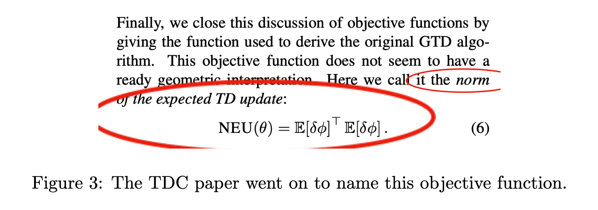
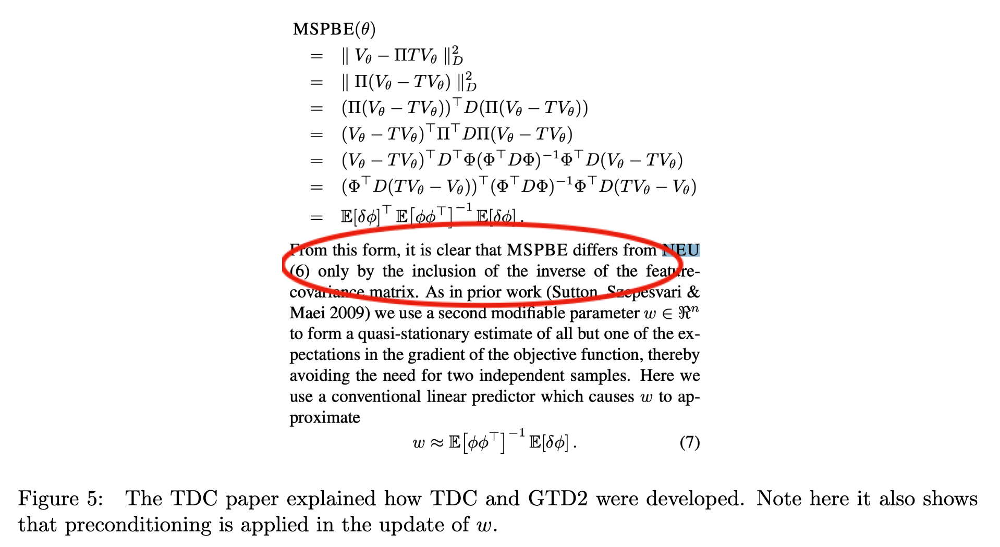

GTD's convergence is possible because the O.D.E is stablized by $A^TA$ instead of the problematic $A$ in TD for off-policy learning. 

Was "NEU" new in what sense?

GTD2/TDC derivation (starting from 2-norm): The L2 objective, $(Ax+b)^T (Ax+b)$ leads to slow update (as shown in the preconditioning paper). GTD2 and TDC start from that we want to solve one system faster, just one $(Ax+b)$. So we apply a preconditioner and aim for an iteration like $\delta x = C^{-1}(Ax+b)$. Recall that in the gradient descent for TD idea, the key is to make a symmetric O.D.E. for off-policy learning. So we change the L2 objective into, $(Ax+b)^T \cdot C^{-1}(Ax+b)$, and solve this system with two iterations. Note that $C^{-1}(Ax+b)$ is a simple linear regression problem (LMS). GTD2 and TDC are both based on approximating $C^{-1}(Ax+b)$ with samples. They are slightly different (in whether you use $C^{-1}A$ or the equivalent, $C^{-1}(C+ D)=I+C^{-1}D$, where $D=A-C$. 

That said, the MSPBE is a simple L2 objecitve too because $(Ax+b)^T \cdot C^{-1}(Ax+b)=$\|C^{-1/2}(Ax+b)\|^2$. The paper presented it using the D-norm simply because this L2 form can be written equivalently in the D-norm due to that $D^T \Phi(\Phi^TD\Phi)^{-1} \Phi^T D=\Pi D \Pi $ (in the paper). $$\Pi D \Pi$ corresponds to the D-norm, and $D^T \Phi(\Phi^TD\Phi)^{-1} \Phi^T D$ corresponds to the L2 norm. 

In short, let's use $A^TC^{-1}A$ as the iteration matrix then. This lead to the MSPBE in the GTD2/TDC paper. GTD2/TDC paper exploited both **symmetry** and **preconditioning**, both of which were proposed in the preconditioning paper. The GTD2/TDC paper is a warping of the preconditioned update. 

